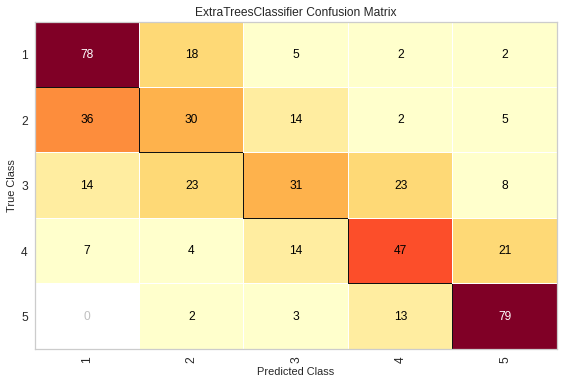

## Feature Engineering EDA For Dengue Competition

Since feature engineering plays such a huge role in this competition, this pipeline is used to see which features contribute to an improving score and which ones do not.

The following notebook is to explore the following:

* Rolling Features (testing different rolling windows on performance)
* Exponential Weighted Averaging (different spans)
* Automatic Feature Generation (with TSFresh)
* Feature Selection (removing zero variance features, etc.)


```python
import seaborn as sns
# sns.set_theme("poster")

import pandas as pd
pd.options.display.max_columns = 200
pd.options.display.max_rows = 200

import numpy as np

import matplotlib.pyplot as plt
plt.rcParams['figure.figsize'] = [14, 12] 
```


```python
path = "../dengue_data/"

X_train = pd.read_csv(path + "dengue_features_train.csv")
y_train = pd.read_csv(path + "dengue_labels_train.csv")
X_test = pd.read_csv(path +  "dengue_features_test.csv")

full_train = X_train.copy()
full_train['total_cases'] = y_train['total_cases']

submission_format = pd.read_csv(path + "/submission_format.csv")
```


```python
sns.lineplot(x = "weekofyear", y = "total_cases", hue = "city", data = full_train).set_title("Total Cases")
```


    Text(0.5, 1.0, 'Total Cases')


## Load and quick looks


```python
X_train.head()
```


<div>
<style scoped>
    .dataframe tbody tr th:only-of-type {
        vertical-align: middle;
    }

    .dataframe tbody tr th {
        vertical-align: top;
    }

    .dataframe thead th {
        text-align: right;
    }
</style>
<table border="1" class="dataframe">
  <thead>
    <tr style="text-align: right;">
      <th></th>
      <th>city</th>
      <th>year</th>
      <th>weekofyear</th>
      <th>week_start_date</th>
      <th>ndvi_ne</th>
      <th>ndvi_nw</th>
      <th>ndvi_se</th>
      <th>ndvi_sw</th>
      <th>precipitation_amt_mm</th>
      <th>reanalysis_air_temp_k</th>
      <th>reanalysis_avg_temp_k</th>
      <th>reanalysis_dew_point_temp_k</th>
      <th>reanalysis_max_air_temp_k</th>
      <th>reanalysis_min_air_temp_k</th>
      <th>reanalysis_precip_amt_kg_per_m2</th>
      <th>reanalysis_relative_humidity_percent</th>
      <th>reanalysis_sat_precip_amt_mm</th>
      <th>reanalysis_specific_humidity_g_per_kg</th>
      <th>reanalysis_tdtr_k</th>
      <th>station_avg_temp_c</th>
      <th>station_diur_temp_rng_c</th>
      <th>station_max_temp_c</th>
      <th>station_min_temp_c</th>
      <th>station_precip_mm</th>
    </tr>
  </thead>
  <tbody>
    <tr>
      <th>0</th>
      <td>sj</td>
      <td>1990</td>
      <td>18</td>
      <td>1990-04-30</td>
      <td>0.122600</td>
      <td>0.103725</td>
      <td>0.198483</td>
      <td>0.177617</td>
      <td>12.42</td>
      <td>297.572857</td>
      <td>297.742857</td>
      <td>292.414286</td>
      <td>299.8</td>
      <td>295.9</td>
      <td>32.00</td>
      <td>73.365714</td>
      <td>12.42</td>
      <td>14.012857</td>
      <td>2.628571</td>
      <td>25.442857</td>
      <td>6.900000</td>
      <td>29.4</td>
      <td>20.0</td>
      <td>16.0</td>
    </tr>
    <tr>
      <th>1</th>
      <td>sj</td>
      <td>1990</td>
      <td>19</td>
      <td>1990-05-07</td>
      <td>0.169900</td>
      <td>0.142175</td>
      <td>0.162357</td>
      <td>0.155486</td>
      <td>22.82</td>
      <td>298.211429</td>
      <td>298.442857</td>
      <td>293.951429</td>
      <td>300.9</td>
      <td>296.4</td>
      <td>17.94</td>
      <td>77.368571</td>
      <td>22.82</td>
      <td>15.372857</td>
      <td>2.371429</td>
      <td>26.714286</td>
      <td>6.371429</td>
      <td>31.7</td>
      <td>22.2</td>
      <td>8.6</td>
    </tr>
    <tr>
      <th>2</th>
      <td>sj</td>
      <td>1990</td>
      <td>20</td>
      <td>1990-05-14</td>
      <td>0.032250</td>
      <td>0.172967</td>
      <td>0.157200</td>
      <td>0.170843</td>
      <td>34.54</td>
      <td>298.781429</td>
      <td>298.878571</td>
      <td>295.434286</td>
      <td>300.5</td>
      <td>297.3</td>
      <td>26.10</td>
      <td>82.052857</td>
      <td>34.54</td>
      <td>16.848571</td>
      <td>2.300000</td>
      <td>26.714286</td>
      <td>6.485714</td>
      <td>32.2</td>
      <td>22.8</td>
      <td>41.4</td>
    </tr>
    <tr>
      <th>3</th>
      <td>sj</td>
      <td>1990</td>
      <td>21</td>
      <td>1990-05-21</td>
      <td>0.128633</td>
      <td>0.245067</td>
      <td>0.227557</td>
      <td>0.235886</td>
      <td>15.36</td>
      <td>298.987143</td>
      <td>299.228571</td>
      <td>295.310000</td>
      <td>301.4</td>
      <td>297.0</td>
      <td>13.90</td>
      <td>80.337143</td>
      <td>15.36</td>
      <td>16.672857</td>
      <td>2.428571</td>
      <td>27.471429</td>
      <td>6.771429</td>
      <td>33.3</td>
      <td>23.3</td>
      <td>4.0</td>
    </tr>
    <tr>
      <th>4</th>
      <td>sj</td>
      <td>1990</td>
      <td>22</td>
      <td>1990-05-28</td>
      <td>0.196200</td>
      <td>0.262200</td>
      <td>0.251200</td>
      <td>0.247340</td>
      <td>7.52</td>
      <td>299.518571</td>
      <td>299.664286</td>
      <td>295.821429</td>
      <td>301.9</td>
      <td>297.5</td>
      <td>12.20</td>
      <td>80.460000</td>
      <td>7.52</td>
      <td>17.210000</td>
      <td>3.014286</td>
      <td>28.942857</td>
      <td>9.371429</td>
      <td>35.0</td>
      <td>23.9</td>
      <td>5.8</td>
    </tr>
  </tbody>
</table>
</div>


```python
y_train.head()
```


<div>
<style scoped>
    .dataframe tbody tr th:only-of-type {
        vertical-align: middle;
    }

    .dataframe tbody tr th {
        vertical-align: top;
    }

    .dataframe thead th {
        text-align: right;
    }
</style>
<table border="1" class="dataframe">
  <thead>
    <tr style="text-align: right;">
      <th></th>
      <th>city</th>
      <th>year</th>
      <th>weekofyear</th>
      <th>total_cases</th>
    </tr>
  </thead>
  <tbody>
    <tr>
      <th>0</th>
      <td>sj</td>
      <td>1990</td>
      <td>18</td>
      <td>4</td>
    </tr>
    <tr>
      <th>1</th>
      <td>sj</td>
      <td>1990</td>
      <td>19</td>
      <td>5</td>
    </tr>
    <tr>
      <th>2</th>
      <td>sj</td>
      <td>1990</td>
      <td>20</td>
      <td>4</td>
    </tr>
    <tr>
      <th>3</th>
      <td>sj</td>
      <td>1990</td>
      <td>21</td>
      <td>3</td>
    </tr>
    <tr>
      <th>4</th>
      <td>sj</td>
      <td>1990</td>
      <td>22</td>
      <td>6</td>
    </tr>
  </tbody>
</table>
</div>


```python
submission_format.head()
```


<div>
<style scoped>
    .dataframe tbody tr th:only-of-type {
        vertical-align: middle;
    }

    .dataframe tbody tr th {
        vertical-align: top;
    }

    .dataframe thead th {
        text-align: right;
    }
</style>
<table border="1" class="dataframe">
  <thead>
    <tr style="text-align: right;">
      <th></th>
      <th>city</th>
      <th>year</th>
      <th>weekofyear</th>
      <th>total_cases</th>
    </tr>
  </thead>
  <tbody>
    <tr>
      <th>0</th>
      <td>sj</td>
      <td>2008</td>
      <td>18</td>
      <td>0</td>
    </tr>
    <tr>
      <th>1</th>
      <td>sj</td>
      <td>2008</td>
      <td>19</td>
      <td>0</td>
    </tr>
    <tr>
      <th>2</th>
      <td>sj</td>
      <td>2008</td>
      <td>20</td>
      <td>0</td>
    </tr>
    <tr>
      <th>3</th>
      <td>sj</td>
      <td>2008</td>
      <td>21</td>
      <td>0</td>
    </tr>
    <tr>
      <th>4</th>
      <td>sj</td>
      <td>2008</td>
      <td>22</td>
      <td>0</td>
    </tr>
  </tbody>
</table>
</div>


```python
submission_format.city.value_counts()
```


    sj    260
    iq    156
    Name: city, dtype: int64


```python
X_test.head()
```


<div>
<style scoped>
    .dataframe tbody tr th:only-of-type {
        vertical-align: middle;
    }

    .dataframe tbody tr th {
        vertical-align: top;
    }

    .dataframe thead th {
        text-align: right;
    }
</style>
<table border="1" class="dataframe">
  <thead>
    <tr style="text-align: right;">
      <th></th>
      <th>city</th>
      <th>year</th>
      <th>weekofyear</th>
      <th>week_start_date</th>
      <th>ndvi_ne</th>
      <th>ndvi_nw</th>
      <th>ndvi_se</th>
      <th>ndvi_sw</th>
      <th>precipitation_amt_mm</th>
      <th>reanalysis_air_temp_k</th>
      <th>reanalysis_avg_temp_k</th>
      <th>reanalysis_dew_point_temp_k</th>
      <th>reanalysis_max_air_temp_k</th>
      <th>reanalysis_min_air_temp_k</th>
      <th>reanalysis_precip_amt_kg_per_m2</th>
      <th>reanalysis_relative_humidity_percent</th>
      <th>reanalysis_sat_precip_amt_mm</th>
      <th>reanalysis_specific_humidity_g_per_kg</th>
      <th>reanalysis_tdtr_k</th>
      <th>station_avg_temp_c</th>
      <th>station_diur_temp_rng_c</th>
      <th>station_max_temp_c</th>
      <th>station_min_temp_c</th>
      <th>station_precip_mm</th>
    </tr>
  </thead>
  <tbody>
    <tr>
      <th>0</th>
      <td>sj</td>
      <td>2008</td>
      <td>18</td>
      <td>2008-04-29</td>
      <td>-0.0189</td>
      <td>-0.018900</td>
      <td>0.102729</td>
      <td>0.091200</td>
      <td>78.60</td>
      <td>298.492857</td>
      <td>298.550000</td>
      <td>294.527143</td>
      <td>301.1</td>
      <td>296.4</td>
      <td>25.37</td>
      <td>78.781429</td>
      <td>78.60</td>
      <td>15.918571</td>
      <td>3.128571</td>
      <td>26.528571</td>
      <td>7.057143</td>
      <td>33.3</td>
      <td>21.7</td>
      <td>75.2</td>
    </tr>
    <tr>
      <th>1</th>
      <td>sj</td>
      <td>2008</td>
      <td>19</td>
      <td>2008-05-06</td>
      <td>-0.0180</td>
      <td>-0.012400</td>
      <td>0.082043</td>
      <td>0.072314</td>
      <td>12.56</td>
      <td>298.475714</td>
      <td>298.557143</td>
      <td>294.395714</td>
      <td>300.8</td>
      <td>296.7</td>
      <td>21.83</td>
      <td>78.230000</td>
      <td>12.56</td>
      <td>15.791429</td>
      <td>2.571429</td>
      <td>26.071429</td>
      <td>5.557143</td>
      <td>30.0</td>
      <td>22.2</td>
      <td>34.3</td>
    </tr>
    <tr>
      <th>2</th>
      <td>sj</td>
      <td>2008</td>
      <td>20</td>
      <td>2008-05-13</td>
      <td>-0.0015</td>
      <td>NaN</td>
      <td>0.151083</td>
      <td>0.091529</td>
      <td>3.66</td>
      <td>299.455714</td>
      <td>299.357143</td>
      <td>295.308571</td>
      <td>302.2</td>
      <td>296.4</td>
      <td>4.12</td>
      <td>78.270000</td>
      <td>3.66</td>
      <td>16.674286</td>
      <td>4.428571</td>
      <td>27.928571</td>
      <td>7.785714</td>
      <td>32.8</td>
      <td>22.8</td>
      <td>3.0</td>
    </tr>
    <tr>
      <th>3</th>
      <td>sj</td>
      <td>2008</td>
      <td>21</td>
      <td>2008-05-20</td>
      <td>NaN</td>
      <td>-0.019867</td>
      <td>0.124329</td>
      <td>0.125686</td>
      <td>0.00</td>
      <td>299.690000</td>
      <td>299.728571</td>
      <td>294.402857</td>
      <td>303.0</td>
      <td>296.9</td>
      <td>2.20</td>
      <td>73.015714</td>
      <td>0.00</td>
      <td>15.775714</td>
      <td>4.342857</td>
      <td>28.057143</td>
      <td>6.271429</td>
      <td>33.3</td>
      <td>24.4</td>
      <td>0.3</td>
    </tr>
    <tr>
      <th>4</th>
      <td>sj</td>
      <td>2008</td>
      <td>22</td>
      <td>2008-05-27</td>
      <td>0.0568</td>
      <td>0.039833</td>
      <td>0.062267</td>
      <td>0.075914</td>
      <td>0.76</td>
      <td>299.780000</td>
      <td>299.671429</td>
      <td>294.760000</td>
      <td>302.3</td>
      <td>297.3</td>
      <td>4.36</td>
      <td>74.084286</td>
      <td>0.76</td>
      <td>16.137143</td>
      <td>3.542857</td>
      <td>27.614286</td>
      <td>7.085714</td>
      <td>33.3</td>
      <td>23.3</td>
      <td>84.1</td>
    </tr>
  </tbody>
</table>
</div>


## Statistical Summary


```python
# full_train.groupby("city").describe()
```


```python
bycity_byweek_stats = full_train.groupby(["city", "weekofyear"]).describe()
bycity_byweek_stats.head()
# bycity_byweek_stats.to_csv("../deng_eda/bycity_byweek_stats.csv")  # Save
```


<div>
<style scoped>
    .dataframe tbody tr th:only-of-type {
        vertical-align: middle;
    }

    .dataframe tbody tr th {
        vertical-align: top;
    }

    .dataframe thead tr th {
        text-align: left;
    }

    .dataframe thead tr:last-of-type th {
        text-align: right;
    }
</style>
<table border="1" class="dataframe">
  <thead>
    <tr>
      <th></th>
      <th></th>
      <th colspan="8" halign="left">year</th>
      <th colspan="8" halign="left">ndvi_ne</th>
      <th colspan="8" halign="left">ndvi_nw</th>
      <th colspan="8" halign="left">ndvi_se</th>
      <th colspan="8" halign="left">ndvi_sw</th>
      <th colspan="8" halign="left">precipitation_amt_mm</th>
      <th colspan="8" halign="left">reanalysis_air_temp_k</th>
      <th colspan="8" halign="left">reanalysis_avg_temp_k</th>
      <th colspan="8" halign="left">reanalysis_dew_point_temp_k</th>
      <th colspan="8" halign="left">reanalysis_max_air_temp_k</th>
      <th colspan="8" halign="left">reanalysis_min_air_temp_k</th>
      <th colspan="8" halign="left">reanalysis_precip_amt_kg_per_m2</th>
      <th colspan="8" halign="left">reanalysis_relative_humidity_percent</th>
      <th colspan="8" halign="left">reanalysis_sat_precip_amt_mm</th>
      <th colspan="8" halign="left">reanalysis_specific_humidity_g_per_kg</th>
      <th colspan="8" halign="left">reanalysis_tdtr_k</th>
      <th colspan="8" halign="left">station_avg_temp_c</th>
      <th colspan="8" halign="left">station_diur_temp_rng_c</th>
      <th colspan="8" halign="left">station_max_temp_c</th>
      <th colspan="8" halign="left">station_min_temp_c</th>
      <th colspan="8" halign="left">station_precip_mm</th>
      <th colspan="8" halign="left">total_cases</th>
    </tr>
    <tr>
      <th></th>
      <th></th>
      <th>count</th>
      <th>mean</th>
      <th>std</th>
      <th>min</th>
      <th>25%</th>
      <th>50%</th>
      <th>75%</th>
      <th>max</th>
      <th>count</th>
      <th>mean</th>
      <th>std</th>
      <th>min</th>
      <th>25%</th>
      <th>50%</th>
      <th>75%</th>
      <th>max</th>
      <th>count</th>
      <th>mean</th>
      <th>std</th>
      <th>min</th>
      <th>25%</th>
      <th>50%</th>
      <th>75%</th>
      <th>max</th>
      <th>count</th>
      <th>mean</th>
      <th>std</th>
      <th>min</th>
      <th>25%</th>
      <th>50%</th>
      <th>75%</th>
      <th>max</th>
      <th>count</th>
      <th>mean</th>
      <th>std</th>
      <th>min</th>
      <th>25%</th>
      <th>50%</th>
      <th>75%</th>
      <th>max</th>
      <th>count</th>
      <th>mean</th>
      <th>std</th>
      <th>min</th>
      <th>25%</th>
      <th>50%</th>
      <th>75%</th>
      <th>max</th>
      <th>count</th>
      <th>mean</th>
      <th>std</th>
      <th>min</th>
      <th>25%</th>
      <th>50%</th>
      <th>75%</th>
      <th>max</th>
      <th>count</th>
      <th>mean</th>
      <th>std</th>
      <th>min</th>
      <th>25%</th>
      <th>50%</th>
      <th>75%</th>
      <th>max</th>
      <th>count</th>
      <th>mean</th>
      <th>std</th>
      <th>min</th>
      <th>25%</th>
      <th>50%</th>
      <th>75%</th>
      <th>max</th>
      <th>count</th>
      <th>mean</th>
      <th>std</th>
      <th>min</th>
      <th>25%</th>
      <th>50%</th>
      <th>75%</th>
      <th>max</th>
      <th>count</th>
      <th>mean</th>
      <th>std</th>
      <th>min</th>
      <th>25%</th>
      <th>50%</th>
      <th>75%</th>
      <th>max</th>
      <th>count</th>
      <th>mean</th>
      <th>std</th>
      <th>min</th>
      <th>25%</th>
      <th>50%</th>
      <th>75%</th>
      <th>max</th>
      <th>count</th>
      <th>mean</th>
      <th>std</th>
      <th>min</th>
      <th>25%</th>
      <th>50%</th>
      <th>75%</th>
      <th>max</th>
      <th>count</th>
      <th>mean</th>
      <th>std</th>
      <th>min</th>
      <th>25%</th>
      <th>50%</th>
      <th>75%</th>
      <th>max</th>
      <th>count</th>
      <th>mean</th>
      <th>std</th>
      <th>min</th>
      <th>25%</th>
      <th>50%</th>
      <th>75%</th>
      <th>max</th>
      <th>count</th>
      <th>mean</th>
      <th>std</th>
      <th>min</th>
      <th>25%</th>
      <th>50%</th>
      <th>75%</th>
      <th>max</th>
      <th>count</th>
      <th>mean</th>
      <th>std</th>
      <th>min</th>
      <th>25%</th>
      <th>50%</th>
      <th>75%</th>
      <th>max</th>
      <th>count</th>
      <th>mean</th>
      <th>std</th>
      <th>min</th>
      <th>25%</th>
      <th>50%</th>
      <th>75%</th>
      <th>max</th>
      <th>count</th>
      <th>mean</th>
      <th>std</th>
      <th>min</th>
      <th>25%</th>
      <th>50%</th>
      <th>75%</th>
      <th>max</th>
      <th>count</th>
      <th>mean</th>
      <th>std</th>
      <th>min</th>
      <th>25%</th>
      <th>50%</th>
      <th>75%</th>
      <th>max</th>
      <th>count</th>
      <th>mean</th>
      <th>std</th>
      <th>min</th>
      <th>25%</th>
      <th>50%</th>
      <th>75%</th>
      <th>max</th>
      <th>count</th>
      <th>mean</th>
      <th>std</th>
      <th>min</th>
      <th>25%</th>
      <th>50%</th>
      <th>75%</th>
      <th>max</th>
    </tr>
    <tr>
      <th>city</th>
      <th>weekofyear</th>
      <th></th>
      <th></th>
      <th></th>
      <th></th>
      <th></th>
      <th></th>
      <th></th>
      <th></th>
      <th></th>
      <th></th>
      <th></th>
      <th></th>
      <th></th>
      <th></th>
      <th></th>
      <th></th>
      <th></th>
      <th></th>
      <th></th>
      <th></th>
      <th></th>
      <th></th>
      <th></th>
      <th></th>
      <th></th>
      <th></th>
      <th></th>
      <th></th>
      <th></th>
      <th></th>
      <th></th>
      <th></th>
      <th></th>
      <th></th>
      <th></th>
      <th></th>
      <th></th>
      <th></th>
      <th></th>
      <th></th>
      <th></th>
      <th></th>
      <th></th>
      <th></th>
      <th></th>
      <th></th>
      <th></th>
      <th></th>
      <th></th>
      <th></th>
      <th></th>
      <th></th>
      <th></th>
      <th></th>
      <th></th>
      <th></th>
      <th></th>
      <th></th>
      <th></th>
      <th></th>
      <th></th>
      <th></th>
      <th></th>
      <th></th>
      <th></th>
      <th></th>
      <th></th>
      <th></th>
      <th></th>
      <th></th>
      <th></th>
      <th></th>
      <th></th>
      <th></th>
      <th></th>
      <th></th>
      <th></th>
      <th></th>
      <th></th>
      <th></th>
      <th></th>
      <th></th>
      <th></th>
      <th></th>
      <th></th>
      <th></th>
      <th></th>
      <th></th>
      <th></th>
      <th></th>
      <th></th>
      <th></th>
      <th></th>
      <th></th>
      <th></th>
      <th></th>
      <th></th>
      <th></th>
      <th></th>
      <th></th>
      <th></th>
      <th></th>
      <th></th>
      <th></th>
      <th></th>
      <th></th>
      <th></th>
      <th></th>
      <th></th>
      <th></th>
      <th></th>
      <th></th>
      <th></th>
      <th></th>
      <th></th>
      <th></th>
      <th></th>
      <th></th>
      <th></th>
      <th></th>
      <th></th>
      <th></th>
      <th></th>
      <th></th>
      <th></th>
      <th></th>
      <th></th>
      <th></th>
      <th></th>
      <th></th>
      <th></th>
      <th></th>
      <th></th>
      <th></th>
      <th></th>
      <th></th>
      <th></th>
      <th></th>
      <th></th>
      <th></th>
      <th></th>
      <th></th>
      <th></th>
      <th></th>
      <th></th>
      <th></th>
      <th></th>
      <th></th>
      <th></th>
      <th></th>
      <th></th>
      <th></th>
      <th></th>
      <th></th>
      <th></th>
      <th></th>
      <th></th>
      <th></th>
      <th></th>
      <th></th>
      <th></th>
      <th></th>
      <th></th>
      <th></th>
      <th></th>
      <th></th>
      <th></th>
      <th></th>
      <th></th>
      <th></th>
      <th></th>
      <th></th>
      <th></th>
      <th></th>
      <th></th>
      <th></th>
    </tr>
  </thead>
  <tbody>
    <tr>
      <th rowspan="5" valign="top">iq</th>
      <th>1</th>
      <td>10.0</td>
      <td>2005.5</td>
      <td>3.02765</td>
      <td>2001.0</td>
      <td>2003.25</td>
      <td>2005.5</td>
      <td>2007.75</td>
      <td>2010.0</td>
      <td>10.0</td>
      <td>0.238823</td>
      <td>0.086418</td>
      <td>0.124571</td>
      <td>0.193482</td>
      <td>0.211344</td>
      <td>0.299811</td>
      <td>0.405729</td>
      <td>10.0</td>
      <td>0.215747</td>
      <td>0.064759</td>
      <td>0.155414</td>
      <td>0.166046</td>
      <td>0.192798</td>
      <td>0.236639</td>
      <td>0.348400</td>
      <td>10.0</td>
      <td>0.240763</td>
      <td>0.073521</td>
      <td>0.153271</td>
      <td>0.179654</td>
      <td>0.236107</td>
      <td>0.290121</td>
      <td>0.368643</td>
      <td>10.0</td>
      <td>0.223386</td>
      <td>0.087723</td>
      <td>0.119443</td>
      <td>0.148414</td>
      <td>0.201729</td>
      <td>0.282850</td>
      <td>0.380014</td>
      <td>8.0</td>
      <td>51.56125</td>
      <td>21.896777</td>
      <td>19.95</td>
      <td>35.845</td>
      <td>53.010</td>
      <td>70.2700</td>
      <td>79.94</td>
      <td>8.0</td>
      <td>298.411607</td>
      <td>0.906067</td>
      <td>297.132857</td>
      <td>297.791071</td>
      <td>298.497857</td>
      <td>299.267500</td>
      <td>299.375714</td>
      <td>8.0</td>
      <td>299.574107</td>
      <td>1.113814</td>
      <td>297.871429</td>
      <td>298.791071</td>
      <td>299.825000</td>
      <td>300.525000</td>
      <td>300.821429</td>
      <td>8.0</td>
      <td>295.528571</td>
      <td>1.397692</td>
      <td>292.878571</td>
      <td>294.633929</td>
      <td>295.965714</td>
      <td>296.566071</td>
      <td>296.990000</td>
      <td>8.0</td>
      <td>307.175</td>
      <td>1.547117</td>
      <td>304.5</td>
      <td>306.100</td>
      <td>307.85</td>
      <td>308.300</td>
      <td>308.6</td>
      <td>8.0</td>
      <td>293.10</td>
      <td>0.550325</td>
      <td>292.4</td>
      <td>292.725</td>
      <td>293.15</td>
      <td>293.275</td>
      <td>294.1</td>
      <td>8.0</td>
      <td>49.78875</td>
      <td>37.146400</td>
      <td>8.5</td>
      <td>19.8500</td>
      <td>44.955</td>
      <td>70.6750</td>
      <td>109.80</td>
      <td>8.0</td>
      <td>86.580000</td>
      <td>9.110101</td>
      <td>73.161429</td>
      <td>78.570357</td>
      <td>88.532857</td>
      <td>94.680357</td>
      <td>95.927143</td>
      <td>8.0</td>
      <td>51.56125</td>
      <td>21.896777</td>
      <td>19.95</td>
      <td>35.845</td>
      <td>53.010</td>
      <td>70.2700</td>
      <td>79.94</td>
      <td>8.0</td>
      <td>17.146250</td>
      <td>1.406108</td>
      <td>14.524286</td>
      <td>16.226786</td>
      <td>17.535714</td>
      <td>18.200714</td>
      <td>18.672857</td>
      <td>8.0</td>
      <td>9.537500</td>
      <td>2.459585</td>
      <td>5.942857</td>
      <td>7.296429</td>
      <td>10.242857</td>
      <td>11.350000</td>
      <td>12.314286</td>
      <td>7.0</td>
      <td>27.958333</td>
      <td>0.739698</td>
      <td>26.600000</td>
      <td>27.641667</td>
      <td>28.275000</td>
      <td>28.475000</td>
      <td>28.600000</td>
      <td>7.0</td>
      <td>10.189286</td>
      <td>1.518624</td>
      <td>7.950000</td>
      <td>9.275000</td>
      <td>9.95</td>
      <td>11.287500</td>
      <td>12.300000</td>
      <td>8.0</td>
      <td>33.95</td>
      <td>1.297250</td>
      <td>31.9</td>
      <td>33.200</td>
      <td>33.85</td>
      <td>34.650</td>
      <td>36.0</td>
      <td>8.0</td>
      <td>21.8375</td>
      <td>1.056865</td>
      <td>19.7</td>
      <td>21.500</td>
      <td>21.80</td>
      <td>22.550</td>
      <td>23.0</td>
      <td>6.0</td>
      <td>75.916667</td>
      <td>34.453587</td>
      <td>38.9</td>
      <td>51.500</td>
      <td>72.50</td>
      <td>88.400</td>
      <td>133.4</td>
      <td>10.0</td>
      <td>9.3</td>
      <td>10.187683</td>
      <td>0.0</td>
      <td>1.75</td>
      <td>7.0</td>
      <td>10.00</td>
      <td>29.0</td>
    </tr>
    <tr>
      <th>2</th>
      <td>10.0</td>
      <td>2005.5</td>
      <td>3.02765</td>
      <td>2001.0</td>
      <td>2003.25</td>
      <td>2005.5</td>
      <td>2007.75</td>
      <td>2010.0</td>
      <td>10.0</td>
      <td>0.289377</td>
      <td>0.109922</td>
      <td>0.145286</td>
      <td>0.228779</td>
      <td>0.275777</td>
      <td>0.321791</td>
      <td>0.488400</td>
      <td>10.0</td>
      <td>0.260149</td>
      <td>0.099320</td>
      <td>0.122340</td>
      <td>0.202433</td>
      <td>0.241392</td>
      <td>0.348155</td>
      <td>0.402443</td>
      <td>10.0</td>
      <td>0.269627</td>
      <td>0.103342</td>
      <td>0.134300</td>
      <td>0.198220</td>
      <td>0.264300</td>
      <td>0.345825</td>
      <td>0.414929</td>
      <td>10.0</td>
      <td>0.303029</td>
      <td>0.105002</td>
      <td>0.167529</td>
      <td>0.232252</td>
      <td>0.266507</td>
      <td>0.366407</td>
      <td>0.469729</td>
      <td>10.0</td>
      <td>65.13000</td>
      <td>35.395454</td>
      <td>11.77</td>
      <td>40.865</td>
      <td>67.320</td>
      <td>76.8575</td>
      <td>138.46</td>
      <td>10.0</td>
      <td>297.879286</td>
      <td>1.030692</td>
      <td>296.095714</td>
      <td>297.493571</td>
      <td>297.705000</td>
      <td>298.233929</td>
      <td>300.012857</td>
      <td>10.0</td>
      <td>299.180000</td>
      <td>1.244684</td>
      <td>296.535714</td>
      <td>298.767857</td>
      <td>299.089286</td>
      <td>299.805357</td>
      <td>301.271429</td>
      <td>10.0</td>
      <td>295.945857</td>
      <td>0.842794</td>
      <td>294.345714</td>
      <td>295.386071</td>
      <td>296.259286</td>
      <td>296.575000</td>
      <td>296.784286</td>
      <td>10.0</td>
      <td>306.680</td>
      <td>2.658237</td>
      <td>302.1</td>
      <td>304.600</td>
      <td>307.65</td>
      <td>308.450</td>
      <td>309.8</td>
      <td>10.0</td>
      <td>293.47</td>
      <td>1.250822</td>
      <td>291.5</td>
      <td>292.700</td>
      <td>293.65</td>
      <td>294.500</td>
      <td>294.9</td>
      <td>10.0</td>
      <td>70.65400</td>
      <td>48.114066</td>
      <td>5.5</td>
      <td>37.1000</td>
      <td>58.955</td>
      <td>95.5450</td>
      <td>144.60</td>
      <td>10.0</td>
      <td>90.671857</td>
      <td>6.641682</td>
      <td>76.602857</td>
      <td>88.703571</td>
      <td>93.391429</td>
      <td>95.467500</td>
      <td>96.238571</td>
      <td>10.0</td>
      <td>65.13000</td>
      <td>35.395454</td>
      <td>11.77</td>
      <td>40.865</td>
      <td>67.320</td>
      <td>76.8575</td>
      <td>138.46</td>
      <td>10.0</td>
      <td>17.553286</td>
      <td>0.907730</td>
      <td>15.858571</td>
      <td>16.885357</td>
      <td>17.860714</td>
      <td>18.233214</td>
      <td>18.461429</td>
      <td>10.0</td>
      <td>8.271429</td>
      <td>2.095898</td>
      <td>5.100000</td>
      <td>6.853571</td>
      <td>7.964286</td>
      <td>9.703571</td>
      <td>11.400000</td>
      <td>10.0</td>
      <td>27.623833</td>
      <td>0.983544</td>
      <td>25.800000</td>
      <td>27.066667</td>
      <td>27.606667</td>
      <td>28.258333</td>
      <td>28.966667</td>
      <td>10.0</td>
      <td>9.985000</td>
      <td>1.825120</td>
      <td>6.300000</td>
      <td>9.050000</td>
      <td>10.70</td>
      <td>11.193750</td>
      <td>11.933333</td>
      <td>10.0</td>
      <td>33.86</td>
      <td>1.352528</td>
      <td>31.4</td>
      <td>33.450</td>
      <td>34.20</td>
      <td>34.725</td>
      <td>35.4</td>
      <td>10.0</td>
      <td>21.8800</td>
      <td>0.768548</td>
      <td>20.7</td>
      <td>21.175</td>
      <td>22.10</td>
      <td>22.475</td>
      <td>22.9</td>
      <td>10.0</td>
      <td>79.850000</td>
      <td>66.446541</td>
      <td>7.1</td>
      <td>41.300</td>
      <td>60.80</td>
      <td>99.825</td>
      <td>232.1</td>
      <td>10.0</td>
      <td>13.8</td>
      <td>16.578433</td>
      <td>0.0</td>
      <td>5.00</td>
      <td>9.5</td>
      <td>13.25</td>
      <td>58.0</td>
    </tr>
    <tr>
      <th>3</th>
      <td>10.0</td>
      <td>2005.5</td>
      <td>3.02765</td>
      <td>2001.0</td>
      <td>2003.25</td>
      <td>2005.5</td>
      <td>2007.75</td>
      <td>2010.0</td>
      <td>10.0</td>
      <td>0.246766</td>
      <td>0.064571</td>
      <td>0.174300</td>
      <td>0.188293</td>
      <td>0.246600</td>
      <td>0.295225</td>
      <td>0.345933</td>
      <td>10.0</td>
      <td>0.209562</td>
      <td>0.073947</td>
      <td>0.103317</td>
      <td>0.151604</td>
      <td>0.204507</td>
      <td>0.277971</td>
      <td>0.311800</td>
      <td>10.0</td>
      <td>0.237119</td>
      <td>0.060470</td>
      <td>0.111757</td>
      <td>0.205289</td>
      <td>0.245743</td>
      <td>0.287757</td>
      <td>0.306720</td>
      <td>10.0</td>
      <td>0.255085</td>
      <td>0.066168</td>
      <td>0.169971</td>
      <td>0.195232</td>
      <td>0.264900</td>
      <td>0.302411</td>
      <td>0.340240</td>
      <td>10.0</td>
      <td>75.97100</td>
      <td>41.256150</td>
      <td>19.04</td>
      <td>60.475</td>
      <td>67.750</td>
      <td>94.1900</td>
      <td>149.71</td>
      <td>10.0</td>
      <td>298.247714</td>
      <td>1.141760</td>
      <td>296.682857</td>
      <td>297.478571</td>
      <td>298.201429</td>
      <td>298.809286</td>
      <td>300.068571</td>
      <td>10.0</td>
      <td>299.617857</td>
      <td>1.269283</td>
      <td>297.414286</td>
      <td>298.700000</td>
      <td>299.796429</td>
      <td>300.401786</td>
      <td>301.564286</td>
      <td>10.0</td>
      <td>296.176714</td>
      <td>0.793109</td>
      <td>294.605714</td>
      <td>296.006429</td>
      <td>296.384286</td>
      <td>296.539643</td>
      <td>297.090000</td>
      <td>10.0</td>
      <td>306.830</td>
      <td>1.806193</td>
      <td>304.0</td>
      <td>305.500</td>
      <td>306.75</td>
      <td>308.475</td>
      <td>309.4</td>
      <td>10.0</td>
      <td>293.94</td>
      <td>1.180584</td>
      <td>291.8</td>
      <td>293.325</td>
      <td>294.25</td>
      <td>294.950</td>
      <td>295.2</td>
      <td>10.0</td>
      <td>49.60100</td>
      <td>39.969424</td>
      <td>4.7</td>
      <td>27.0000</td>
      <td>41.700</td>
      <td>59.9250</td>
      <td>149.77</td>
      <td>10.0</td>
      <td>89.900571</td>
      <td>7.305249</td>
      <td>75.204286</td>
      <td>85.042143</td>
      <td>92.165000</td>
      <td>94.888214</td>
      <td>98.610000</td>
      <td>10.0</td>
      <td>75.97100</td>
      <td>41.256150</td>
      <td>19.04</td>
      <td>60.475</td>
      <td>67.750</td>
      <td>94.1900</td>
      <td>149.71</td>
      <td>10.0</td>
      <td>17.793857</td>
      <td>0.855349</td>
      <td>16.157143</td>
      <td>17.557857</td>
      <td>17.985714</td>
      <td>18.194286</td>
      <td>18.865714</td>
      <td>10.0</td>
      <td>8.618571</td>
      <td>2.502027</td>
      <td>3.714286</td>
      <td>7.217857</td>
      <td>8.607143</td>
      <td>10.546429</td>
      <td>12.128571</td>
      <td>9.0</td>
      <td>28.085741</td>
      <td>0.766162</td>
      <td>27.050000</td>
      <td>27.433333</td>
      <td>28.000000</td>
      <td>28.800000</td>
      <td>28.966667</td>
      <td>9.0</td>
      <td>10.528519</td>
      <td>1.102302</td>
      <td>9.466667</td>
      <td>9.550000</td>
      <td>10.24</td>
      <td>11.166667</td>
      <td>12.766667</td>
      <td>10.0</td>
      <td>34.14</td>
      <td>1.050079</td>
      <td>33.0</td>
      <td>33.325</td>
      <td>33.80</td>
      <td>34.925</td>
      <td>36.0</td>
      <td>10.0</td>
      <td>21.9700</td>
      <td>0.770353</td>
      <td>20.5</td>
      <td>21.575</td>
      <td>22.10</td>
      <td>22.500</td>
      <td>23.1</td>
      <td>10.0</td>
      <td>91.520000</td>
      <td>69.887589</td>
      <td>0.8</td>
      <td>52.700</td>
      <td>70.45</td>
      <td>154.625</td>
      <td>194.0</td>
      <td>10.0</td>
      <td>10.8</td>
      <td>7.269418</td>
      <td>0.0</td>
      <td>6.50</td>
      <td>9.0</td>
      <td>14.75</td>
      <td>26.0</td>
    </tr>
    <tr>
      <th>4</th>
      <td>10.0</td>
      <td>2005.5</td>
      <td>3.02765</td>
      <td>2001.0</td>
      <td>2003.25</td>
      <td>2005.5</td>
      <td>2007.75</td>
      <td>2010.0</td>
      <td>10.0</td>
      <td>0.232678</td>
      <td>0.077953</td>
      <td>0.104129</td>
      <td>0.189761</td>
      <td>0.231279</td>
      <td>0.274296</td>
      <td>0.364367</td>
      <td>10.0</td>
      <td>0.224632</td>
      <td>0.073870</td>
      <td>0.137700</td>
      <td>0.159063</td>
      <td>0.214957</td>
      <td>0.273504</td>
      <td>0.336529</td>
      <td>10.0</td>
      <td>0.204731</td>
      <td>0.059817</td>
      <td>0.112186</td>
      <td>0.161525</td>
      <td>0.212900</td>
      <td>0.247929</td>
      <td>0.292557</td>
      <td>10.0</td>
      <td>0.252618</td>
      <td>0.065000</td>
      <td>0.141914</td>
      <td>0.218307</td>
      <td>0.270986</td>
      <td>0.294129</td>
      <td>0.344114</td>
      <td>10.0</td>
      <td>77.20900</td>
      <td>38.271617</td>
      <td>25.67</td>
      <td>49.495</td>
      <td>80.105</td>
      <td>100.8100</td>
      <td>138.51</td>
      <td>10.0</td>
      <td>297.888429</td>
      <td>1.285849</td>
      <td>295.722857</td>
      <td>297.193214</td>
      <td>297.870000</td>
      <td>298.759643</td>
      <td>299.648571</td>
      <td>10.0</td>
      <td>299.026429</td>
      <td>1.418464</td>
      <td>296.671429</td>
      <td>298.305357</td>
      <td>299.007143</td>
      <td>299.812500</td>
      <td>301.107143</td>
      <td>10.0</td>
      <td>295.827714</td>
      <td>0.854432</td>
      <td>294.594286</td>
      <td>295.116786</td>
      <td>295.833571</td>
      <td>296.482500</td>
      <td>297.025714</td>
      <td>10.0</td>
      <td>305.970</td>
      <td>2.521485</td>
      <td>301.8</td>
      <td>303.975</td>
      <td>306.25</td>
      <td>308.250</td>
      <td>308.7</td>
      <td>10.0</td>
      <td>293.74</td>
      <td>1.242041</td>
      <td>291.6</td>
      <td>292.825</td>
      <td>294.00</td>
      <td>294.875</td>
      <td>295.0</td>
      <td>10.0</td>
      <td>62.45700</td>
      <td>50.339091</td>
      <td>8.8</td>
      <td>25.4925</td>
      <td>53.005</td>
      <td>82.4625</td>
      <td>180.99</td>
      <td>10.0</td>
      <td>89.932714</td>
      <td>5.548915</td>
      <td>81.527143</td>
      <td>85.173214</td>
      <td>92.132857</td>
      <td>93.821429</td>
      <td>96.997143</td>
      <td>10.0</td>
      <td>77.20900</td>
      <td>38.271617</td>
      <td>25.67</td>
      <td>49.495</td>
      <td>80.105</td>
      <td>100.8100</td>
      <td>138.51</td>
      <td>10.0</td>
      <td>17.412714</td>
      <td>0.924362</td>
      <td>16.071429</td>
      <td>16.650357</td>
      <td>17.427857</td>
      <td>18.104643</td>
      <td>18.688571</td>
      <td>10.0</td>
      <td>7.921429</td>
      <td>2.255728</td>
      <td>5.528571</td>
      <td>6.032143</td>
      <td>7.085714</td>
      <td>10.157143</td>
      <td>11.228571</td>
      <td>9.0</td>
      <td>27.780370</td>
      <td>0.938066</td>
      <td>25.716667</td>
      <td>27.566667</td>
      <td>27.800000</td>
      <td>28.400000</td>
      <td>28.866667</td>
      <td>9.0</td>
      <td>10.510000</td>
      <td>1.142838</td>
      <td>8.950000</td>
      <td>9.433333</td>
      <td>10.60</td>
      <td>11.400000</td>
      <td>12.066667</td>
      <td>10.0</td>
      <td>33.86</td>
      <td>1.559345</td>
      <td>31.2</td>
      <td>33.525</td>
      <td>34.10</td>
      <td>34.975</td>
      <td>35.8</td>
      <td>10.0</td>
      <td>21.8300</td>
      <td>0.820637</td>
      <td>20.0</td>
      <td>21.800</td>
      <td>21.95</td>
      <td>22.250</td>
      <td>23.0</td>
      <td>10.0</td>
      <td>89.640000</td>
      <td>86.909074</td>
      <td>0.0</td>
      <td>18.525</td>
      <td>56.70</td>
      <td>161.975</td>
      <td>250.9</td>
      <td>10.0</td>
      <td>15.8</td>
      <td>13.062244</td>
      <td>0.0</td>
      <td>5.50</td>
      <td>13.0</td>
      <td>26.75</td>
      <td>38.0</td>
    </tr>
    <tr>
      <th>5</th>
      <td>10.0</td>
      <td>2005.5</td>
      <td>3.02765</td>
      <td>2001.0</td>
      <td>2003.25</td>
      <td>2005.5</td>
      <td>2007.75</td>
      <td>2010.0</td>
      <td>9.0</td>
      <td>0.237898</td>
      <td>0.092811</td>
      <td>0.158229</td>
      <td>0.166733</td>
      <td>0.174414</td>
      <td>0.341500</td>
      <td>0.379114</td>
      <td>9.0</td>
      <td>0.219553</td>
      <td>0.079596</td>
      <td>0.140629</td>
      <td>0.167250</td>
      <td>0.180500</td>
      <td>0.260667</td>
      <td>0.370571</td>
      <td>9.0</td>
      <td>0.221807</td>
      <td>0.084876</td>
      <td>0.117914</td>
      <td>0.159071</td>
      <td>0.191386</td>
      <td>0.313800</td>
      <td>0.345971</td>
      <td>9.0</td>
      <td>0.240064</td>
      <td>0.109322</td>
      <td>0.126600</td>
      <td>0.161717</td>
      <td>0.200314</td>
      <td>0.369071</td>
      <td>0.402971</td>
      <td>10.0</td>
      <td>66.89600</td>
      <td>36.674571</td>
      <td>4.65</td>
      <td>38.115</td>
      <td>71.550</td>
      <td>88.5150</td>
      <td>118.54</td>
      <td>10.0</td>
      <td>298.156286</td>
      <td>1.556750</td>
      <td>295.297143</td>
      <td>297.248214</td>
      <td>298.271429</td>
      <td>298.984643</td>
      <td>300.900000</td>
      <td>10.0</td>
      <td>299.417143</td>
      <td>1.714683</td>
      <td>296.100000</td>
      <td>298.366071</td>
      <td>299.792857</td>
      <td>300.317857</td>
      <td>302.150000</td>
      <td>10.0</td>
      <td>295.808571</td>
      <td>1.490151</td>
      <td>292.832857</td>
      <td>294.842857</td>
      <td>296.580714</td>
      <td>296.821429</td>
      <td>297.011429</td>
      <td>10.0</td>
      <td>306.310</td>
      <td>2.817189</td>
      <td>302.2</td>
      <td>304.250</td>
      <td>306.85</td>
      <td>308.250</td>
      <td>310.0</td>
      <td>10.0</td>
      <td>293.97</td>
      <td>1.085306</td>
      <td>292.2</td>
      <td>293.400</td>
      <td>294.15</td>
      <td>294.300</td>
      <td>295.6</td>
      <td>10.0</td>
      <td>53.62400</td>
      <td>30.140394</td>
      <td>1.6</td>
      <td>44.1650</td>
      <td>64.540</td>
      <td>66.0750</td>
      <td>95.83</td>
      <td>10.0</td>
      <td>89.030286</td>
      <td>10.519384</td>
      <td>65.284286</td>
      <td>89.732500</td>
      <td>93.067857</td>
      <td>95.287500</td>
      <td>97.320000</td>
      <td>10.0</td>
      <td>66.89600</td>
      <td>36.674571</td>
      <td>4.65</td>
      <td>38.115</td>
      <td>71.550</td>
      <td>88.5150</td>
      <td>118.54</td>
      <td>10.0</td>
      <td>17.434429</td>
      <td>1.512532</td>
      <td>14.548571</td>
      <td>16.317500</td>
      <td>18.197143</td>
      <td>18.495714</td>
      <td>18.685714</td>
      <td>10.0</td>
      <td>8.520000</td>
      <td>2.777184</td>
      <td>5.142857</td>
      <td>6.182143</td>
      <td>8.657143</td>
      <td>9.278571</td>
      <td>13.642857</td>
      <td>9.0</td>
      <td>27.725000</td>
      <td>0.906985</td>
      <td>26.300000</td>
      <td>27.566667</td>
      <td>27.725000</td>
      <td>28.525000</td>
      <td>28.925000</td>
      <td>9.0</td>
      <td>10.481481</td>
      <td>1.210177</td>
      <td>8.900000</td>
      <td>9.666667</td>
      <td>10.30</td>
      <td>11.650000</td>
      <td>12.125000</td>
      <td>10.0</td>
      <td>34.09</td>
      <td>1.248510</td>
      <td>32.2</td>
      <td>33.175</td>
      <td>34.05</td>
      <td>35.300</td>
      <td>35.6</td>
      <td>10.0</td>
      <td>21.7500</td>
      <td>0.880972</td>
      <td>20.0</td>
      <td>21.200</td>
      <td>22.10</td>
      <td>22.300</td>
      <td>22.8</td>
      <td>10.0</td>
      <td>71.020000</td>
      <td>54.642470</td>
      <td>0.0</td>
      <td>21.000</td>
      <td>65.05</td>
      <td>119.875</td>
      <td>147.8</td>
      <td>10.0</td>
      <td>14.8</td>
      <td>15.418603</td>
      <td>0.0</td>
      <td>2.75</td>
      <td>9.5</td>
      <td>29.25</td>
      <td>39.0</td>
    </tr>
  </tbody>
</table>
</div>


```python
# bycity_byweek_stats["ndvi_ne"].unstack(level = 0).head(5).style.background_gradient(cmap=sns.diverging_palette(240, 10, as_cmap=True))
```

## Indicate "high total cases"


```python
#full_train.groupby("city").total_cases.quantile([0.25, 0.5, 0.75])
```


```python
# bin_quantiles = pd.qcut(col)
# df.apply(bin_quantiles)
```

## How many cases were there per city


```python
full_train.groupby("city")["total_cases"].sum()
```


    city
    iq     3934
    sj    31993
    Name: total_cases, dtype: int64


### Label quantiles of total_cases and add to features as semi-supervised or self-supervised learning


```python
full_train[full_train.city == "sj"]
```


<div>
<style scoped>
    .dataframe tbody tr th:only-of-type {
        vertical-align: middle;
    }

    .dataframe tbody tr th {
        vertical-align: top;
    }

    .dataframe thead th {
        text-align: right;
    }
</style>
<table border="1" class="dataframe">
  <thead>
    <tr style="text-align: right;">
      <th></th>
      <th>city</th>
      <th>year</th>
      <th>weekofyear</th>
      <th>week_start_date</th>
      <th>ndvi_ne</th>
      <th>ndvi_nw</th>
      <th>ndvi_se</th>
      <th>ndvi_sw</th>
      <th>precipitation_amt_mm</th>
      <th>reanalysis_air_temp_k</th>
      <th>reanalysis_avg_temp_k</th>
      <th>reanalysis_dew_point_temp_k</th>
      <th>reanalysis_max_air_temp_k</th>
      <th>reanalysis_min_air_temp_k</th>
      <th>reanalysis_precip_amt_kg_per_m2</th>
      <th>reanalysis_relative_humidity_percent</th>
      <th>reanalysis_sat_precip_amt_mm</th>
      <th>reanalysis_specific_humidity_g_per_kg</th>
      <th>reanalysis_tdtr_k</th>
      <th>station_avg_temp_c</th>
      <th>station_diur_temp_rng_c</th>
      <th>station_max_temp_c</th>
      <th>station_min_temp_c</th>
      <th>station_precip_mm</th>
      <th>total_cases</th>
    </tr>
  </thead>
  <tbody>
    <tr>
      <th>0</th>
      <td>sj</td>
      <td>1990</td>
      <td>18</td>
      <td>1990-04-30</td>
      <td>0.122600</td>
      <td>0.103725</td>
      <td>0.198483</td>
      <td>0.177617</td>
      <td>12.42</td>
      <td>297.572857</td>
      <td>297.742857</td>
      <td>292.414286</td>
      <td>299.8</td>
      <td>295.9</td>
      <td>32.00</td>
      <td>73.365714</td>
      <td>12.42</td>
      <td>14.012857</td>
      <td>2.628571</td>
      <td>25.442857</td>
      <td>6.900000</td>
      <td>29.4</td>
      <td>20.0</td>
      <td>16.0</td>
      <td>4</td>
    </tr>
    <tr>
      <th>1</th>
      <td>sj</td>
      <td>1990</td>
      <td>19</td>
      <td>1990-05-07</td>
      <td>0.169900</td>
      <td>0.142175</td>
      <td>0.162357</td>
      <td>0.155486</td>
      <td>22.82</td>
      <td>298.211429</td>
      <td>298.442857</td>
      <td>293.951429</td>
      <td>300.9</td>
      <td>296.4</td>
      <td>17.94</td>
      <td>77.368571</td>
      <td>22.82</td>
      <td>15.372857</td>
      <td>2.371429</td>
      <td>26.714286</td>
      <td>6.371429</td>
      <td>31.7</td>
      <td>22.2</td>
      <td>8.6</td>
      <td>5</td>
    </tr>
    <tr>
      <th>2</th>
      <td>sj</td>
      <td>1990</td>
      <td>20</td>
      <td>1990-05-14</td>
      <td>0.032250</td>
      <td>0.172967</td>
      <td>0.157200</td>
      <td>0.170843</td>
      <td>34.54</td>
      <td>298.781429</td>
      <td>298.878571</td>
      <td>295.434286</td>
      <td>300.5</td>
      <td>297.3</td>
      <td>26.10</td>
      <td>82.052857</td>
      <td>34.54</td>
      <td>16.848571</td>
      <td>2.300000</td>
      <td>26.714286</td>
      <td>6.485714</td>
      <td>32.2</td>
      <td>22.8</td>
      <td>41.4</td>
      <td>4</td>
    </tr>
    <tr>
      <th>3</th>
      <td>sj</td>
      <td>1990</td>
      <td>21</td>
      <td>1990-05-21</td>
      <td>0.128633</td>
      <td>0.245067</td>
      <td>0.227557</td>
      <td>0.235886</td>
      <td>15.36</td>
      <td>298.987143</td>
      <td>299.228571</td>
      <td>295.310000</td>
      <td>301.4</td>
      <td>297.0</td>
      <td>13.90</td>
      <td>80.337143</td>
      <td>15.36</td>
      <td>16.672857</td>
      <td>2.428571</td>
      <td>27.471429</td>
      <td>6.771429</td>
      <td>33.3</td>
      <td>23.3</td>
      <td>4.0</td>
      <td>3</td>
    </tr>
    <tr>
      <th>4</th>
      <td>sj</td>
      <td>1990</td>
      <td>22</td>
      <td>1990-05-28</td>
      <td>0.196200</td>
      <td>0.262200</td>
      <td>0.251200</td>
      <td>0.247340</td>
      <td>7.52</td>
      <td>299.518571</td>
      <td>299.664286</td>
      <td>295.821429</td>
      <td>301.9</td>
      <td>297.5</td>
      <td>12.20</td>
      <td>80.460000</td>
      <td>7.52</td>
      <td>17.210000</td>
      <td>3.014286</td>
      <td>28.942857</td>
      <td>9.371429</td>
      <td>35.0</td>
      <td>23.9</td>
      <td>5.8</td>
      <td>6</td>
    </tr>
    <tr>
      <th>...</th>
      <td>...</td>
      <td>...</td>
      <td>...</td>
      <td>...</td>
      <td>...</td>
      <td>...</td>
      <td>...</td>
      <td>...</td>
      <td>...</td>
      <td>...</td>
      <td>...</td>
      <td>...</td>
      <td>...</td>
      <td>...</td>
      <td>...</td>
      <td>...</td>
      <td>...</td>
      <td>...</td>
      <td>...</td>
      <td>...</td>
      <td>...</td>
      <td>...</td>
      <td>...</td>
      <td>...</td>
      <td>...</td>
    </tr>
    <tr>
      <th>931</th>
      <td>sj</td>
      <td>2008</td>
      <td>13</td>
      <td>2008-03-25</td>
      <td>0.077850</td>
      <td>-0.039900</td>
      <td>0.310471</td>
      <td>0.296243</td>
      <td>27.19</td>
      <td>296.958571</td>
      <td>296.957143</td>
      <td>292.095714</td>
      <td>299.7</td>
      <td>294.4</td>
      <td>7.55</td>
      <td>74.247143</td>
      <td>27.19</td>
      <td>13.644286</td>
      <td>2.885714</td>
      <td>25.042857</td>
      <td>5.785714</td>
      <td>30.0</td>
      <td>21.1</td>
      <td>1.8</td>
      <td>4</td>
    </tr>
    <tr>
      <th>932</th>
      <td>sj</td>
      <td>2008</td>
      <td>14</td>
      <td>2008-04-01</td>
      <td>-0.038000</td>
      <td>-0.016833</td>
      <td>0.119371</td>
      <td>0.066386</td>
      <td>3.82</td>
      <td>298.081429</td>
      <td>298.228571</td>
      <td>293.235714</td>
      <td>299.8</td>
      <td>296.5</td>
      <td>3.67</td>
      <td>74.600000</td>
      <td>3.82</td>
      <td>14.662857</td>
      <td>2.714286</td>
      <td>26.242857</td>
      <td>6.814286</td>
      <td>30.6</td>
      <td>22.2</td>
      <td>0.5</td>
      <td>3</td>
    </tr>
    <tr>
      <th>933</th>
      <td>sj</td>
      <td>2008</td>
      <td>15</td>
      <td>2008-04-08</td>
      <td>-0.155200</td>
      <td>-0.052750</td>
      <td>0.137757</td>
      <td>0.141214</td>
      <td>16.96</td>
      <td>297.460000</td>
      <td>297.564286</td>
      <td>292.732857</td>
      <td>299.4</td>
      <td>295.8</td>
      <td>35.00</td>
      <td>75.027143</td>
      <td>16.96</td>
      <td>14.184286</td>
      <td>2.185714</td>
      <td>25.000000</td>
      <td>5.714286</td>
      <td>29.4</td>
      <td>21.7</td>
      <td>30.7</td>
      <td>1</td>
    </tr>
    <tr>
      <th>934</th>
      <td>sj</td>
      <td>2008</td>
      <td>16</td>
      <td>2008-04-15</td>
      <td>0.001800</td>
      <td>NaN</td>
      <td>0.203900</td>
      <td>0.209843</td>
      <td>0.00</td>
      <td>297.630000</td>
      <td>297.778571</td>
      <td>292.274286</td>
      <td>299.7</td>
      <td>295.9</td>
      <td>4.82</td>
      <td>72.285714</td>
      <td>0.00</td>
      <td>13.858571</td>
      <td>2.785714</td>
      <td>25.314286</td>
      <td>6.242857</td>
      <td>29.4</td>
      <td>21.7</td>
      <td>11.2</td>
      <td>3</td>
    </tr>
    <tr>
      <th>935</th>
      <td>sj</td>
      <td>2008</td>
      <td>17</td>
      <td>2008-04-22</td>
      <td>-0.037000</td>
      <td>-0.010367</td>
      <td>0.077314</td>
      <td>0.090586</td>
      <td>0.00</td>
      <td>298.672857</td>
      <td>298.692857</td>
      <td>294.280000</td>
      <td>300.9</td>
      <td>295.9</td>
      <td>2.17</td>
      <td>76.960000</td>
      <td>0.00</td>
      <td>15.671429</td>
      <td>3.957143</td>
      <td>27.042857</td>
      <td>7.514286</td>
      <td>31.7</td>
      <td>23.3</td>
      <td>0.3</td>
      <td>5</td>
    </tr>
  </tbody>
</table>
<p>936 rows × 25 columns</p>
</div>


```python
sj_quantile_labels = pd.qcut(full_train[full_train.city == "sj"].total_cases, 5, labels = range(1, 6))
sj_quantile_labels = sj_quantile_labels.rename("quantile")
sj_quantile_labels.to_csv("../deng_features/sj_quantile_labels.csv")

iq_quantile_labels = pd.qcut(full_train[full_train.city == "iq"].total_cases, 5, labels = range(1, 6))
iq_quantile_labels = iq_quantile_labels.rename("quantile")
iq_quantile_labels.to_csv("../deng_features/iq_quantile_labels.csv")
```


```python
sj_quantile_labels
```


    0      1
    1      1
    2      1
    3      1
    4      1
          ..
    931    1
    932    1
    933    1
    934    1
    935    1
    Name: quantile, Length: 936, dtype: category
    Categories (5, int64): [1 < 2 < 3 < 4 < 5]


```python
sj_quantile_dummies = pd.get_dummies(sj_quantile_labels, prefix = "quantile_")
sj_quantile_dummies.head(2)
```


<div>
<style scoped>
    .dataframe tbody tr th:only-of-type {
        vertical-align: middle;
    }

    .dataframe tbody tr th {
        vertical-align: top;
    }

    .dataframe thead th {
        text-align: right;
    }
</style>
<table border="1" class="dataframe">
  <thead>
    <tr style="text-align: right;">
      <th></th>
      <th>quantile__1</th>
      <th>quantile__2</th>
      <th>quantile__3</th>
      <th>quantile__4</th>
      <th>quantile__5</th>
    </tr>
  </thead>
  <tbody>
    <tr>
      <th>0</th>
      <td>1</td>
      <td>0</td>
      <td>0</td>
      <td>0</td>
      <td>0</td>
    </tr>
    <tr>
      <th>1</th>
      <td>1</td>
      <td>0</td>
      <td>0</td>
      <td>0</td>
      <td>0</td>
    </tr>
  </tbody>
</table>
</div>


```python
iq_quantile_labels
```


    936     1
    937     1
    938     1
    939     1
    940     1
           ..
    1451    3
    1452    4
    1453    1
    1454    1
    1455    3
    Name: quantile, Length: 520, dtype: category
    Categories (5, int64): [1 < 2 < 3 < 4 < 5]


```python
iq_quantile_dummies = pd.get_dummies(iq_quantile_labels, prefix = "quantile_")
```


```python
iq_quantile_dummies
```


<div>
<style scoped>
    .dataframe tbody tr th:only-of-type {
        vertical-align: middle;
    }

    .dataframe tbody tr th {
        vertical-align: top;
    }

    .dataframe thead th {
        text-align: right;
    }
</style>
<table border="1" class="dataframe">
  <thead>
    <tr style="text-align: right;">
      <th></th>
      <th>quantile__1</th>
      <th>quantile__2</th>
      <th>quantile__3</th>
      <th>quantile__4</th>
      <th>quantile__5</th>
    </tr>
  </thead>
  <tbody>
    <tr>
      <th>936</th>
      <td>1</td>
      <td>0</td>
      <td>0</td>
      <td>0</td>
      <td>0</td>
    </tr>
    <tr>
      <th>937</th>
      <td>1</td>
      <td>0</td>
      <td>0</td>
      <td>0</td>
      <td>0</td>
    </tr>
    <tr>
      <th>938</th>
      <td>1</td>
      <td>0</td>
      <td>0</td>
      <td>0</td>
      <td>0</td>
    </tr>
    <tr>
      <th>939</th>
      <td>1</td>
      <td>0</td>
      <td>0</td>
      <td>0</td>
      <td>0</td>
    </tr>
    <tr>
      <th>940</th>
      <td>1</td>
      <td>0</td>
      <td>0</td>
      <td>0</td>
      <td>0</td>
    </tr>
    <tr>
      <th>...</th>
      <td>...</td>
      <td>...</td>
      <td>...</td>
      <td>...</td>
      <td>...</td>
    </tr>
    <tr>
      <th>1451</th>
      <td>0</td>
      <td>0</td>
      <td>1</td>
      <td>0</td>
      <td>0</td>
    </tr>
    <tr>
      <th>1452</th>
      <td>0</td>
      <td>0</td>
      <td>0</td>
      <td>1</td>
      <td>0</td>
    </tr>
    <tr>
      <th>1453</th>
      <td>1</td>
      <td>0</td>
      <td>0</td>
      <td>0</td>
      <td>0</td>
    </tr>
    <tr>
      <th>1454</th>
      <td>1</td>
      <td>0</td>
      <td>0</td>
      <td>0</td>
      <td>0</td>
    </tr>
    <tr>
      <th>1455</th>
      <td>0</td>
      <td>0</td>
      <td>1</td>
      <td>0</td>
      <td>0</td>
    </tr>
  </tbody>
</table>
<p>520 rows × 5 columns</p>
</div>


```python
all_quantile_labels = pd.concat([sj_quantile_labels, iq_quantile_labels])
all_quantile_labels.to_csv("../deng_features/all_quantile_labels.csv")

all_quantile_labels.shape
```


    (1456,)


```python
all_quantile_dummies = pd.get_dummies(all_quantile_labels, prefix = "quantile_")
all_quantile_dummies
```


<div>
<style scoped>
    .dataframe tbody tr th:only-of-type {
        vertical-align: middle;
    }

    .dataframe tbody tr th {
        vertical-align: top;
    }

    .dataframe thead th {
        text-align: right;
    }
</style>
<table border="1" class="dataframe">
  <thead>
    <tr style="text-align: right;">
      <th></th>
      <th>quantile__1</th>
      <th>quantile__2</th>
      <th>quantile__3</th>
      <th>quantile__4</th>
      <th>quantile__5</th>
    </tr>
  </thead>
  <tbody>
    <tr>
      <th>0</th>
      <td>1</td>
      <td>0</td>
      <td>0</td>
      <td>0</td>
      <td>0</td>
    </tr>
    <tr>
      <th>1</th>
      <td>1</td>
      <td>0</td>
      <td>0</td>
      <td>0</td>
      <td>0</td>
    </tr>
    <tr>
      <th>2</th>
      <td>1</td>
      <td>0</td>
      <td>0</td>
      <td>0</td>
      <td>0</td>
    </tr>
    <tr>
      <th>3</th>
      <td>1</td>
      <td>0</td>
      <td>0</td>
      <td>0</td>
      <td>0</td>
    </tr>
    <tr>
      <th>4</th>
      <td>1</td>
      <td>0</td>
      <td>0</td>
      <td>0</td>
      <td>0</td>
    </tr>
    <tr>
      <th>...</th>
      <td>...</td>
      <td>...</td>
      <td>...</td>
      <td>...</td>
      <td>...</td>
    </tr>
    <tr>
      <th>1451</th>
      <td>0</td>
      <td>0</td>
      <td>1</td>
      <td>0</td>
      <td>0</td>
    </tr>
    <tr>
      <th>1452</th>
      <td>0</td>
      <td>0</td>
      <td>0</td>
      <td>1</td>
      <td>0</td>
    </tr>
    <tr>
      <th>1453</th>
      <td>1</td>
      <td>0</td>
      <td>0</td>
      <td>0</td>
      <td>0</td>
    </tr>
    <tr>
      <th>1454</th>
      <td>1</td>
      <td>0</td>
      <td>0</td>
      <td>0</td>
      <td>0</td>
    </tr>
    <tr>
      <th>1455</th>
      <td>0</td>
      <td>0</td>
      <td>1</td>
      <td>0</td>
      <td>0</td>
    </tr>
  </tbody>
</table>
<p>1456 rows × 5 columns</p>
</div>


## Feature Generation EDA


```python
explore_feature = ["precipitation_amt_mm"]
explore_feature_name = "precipitation_amt_mm"

# Quick Preprocessing
X_train_ml = X_train.replace({"sj":0, "iq":1})
X_train_ml = X_train_ml.drop(["year", "weekofyear", "week_start_date"], axis = 1)
X_train_ml.head(2)

```


<div>
<style scoped>
    .dataframe tbody tr th:only-of-type {
        vertical-align: middle;
    }

    .dataframe tbody tr th {
        vertical-align: top;
    }

    .dataframe thead th {
        text-align: right;
    }
</style>
<table border="1" class="dataframe">
  <thead>
    <tr style="text-align: right;">
      <th></th>
      <th>city</th>
      <th>ndvi_ne</th>
      <th>ndvi_nw</th>
      <th>ndvi_se</th>
      <th>ndvi_sw</th>
      <th>precipitation_amt_mm</th>
      <th>reanalysis_air_temp_k</th>
      <th>reanalysis_avg_temp_k</th>
      <th>reanalysis_dew_point_temp_k</th>
      <th>reanalysis_max_air_temp_k</th>
      <th>reanalysis_min_air_temp_k</th>
      <th>reanalysis_precip_amt_kg_per_m2</th>
      <th>reanalysis_relative_humidity_percent</th>
      <th>reanalysis_sat_precip_amt_mm</th>
      <th>reanalysis_specific_humidity_g_per_kg</th>
      <th>reanalysis_tdtr_k</th>
      <th>station_avg_temp_c</th>
      <th>station_diur_temp_rng_c</th>
      <th>station_max_temp_c</th>
      <th>station_min_temp_c</th>
      <th>station_precip_mm</th>
    </tr>
  </thead>
  <tbody>
    <tr>
      <th>0</th>
      <td>0</td>
      <td>0.1226</td>
      <td>0.103725</td>
      <td>0.198483</td>
      <td>0.177617</td>
      <td>12.42</td>
      <td>297.572857</td>
      <td>297.742857</td>
      <td>292.414286</td>
      <td>299.8</td>
      <td>295.9</td>
      <td>32.00</td>
      <td>73.365714</td>
      <td>12.42</td>
      <td>14.012857</td>
      <td>2.628571</td>
      <td>25.442857</td>
      <td>6.900000</td>
      <td>29.4</td>
      <td>20.0</td>
      <td>16.0</td>
    </tr>
    <tr>
      <th>1</th>
      <td>0</td>
      <td>0.1699</td>
      <td>0.142175</td>
      <td>0.162357</td>
      <td>0.155486</td>
      <td>22.82</td>
      <td>298.211429</td>
      <td>298.442857</td>
      <td>293.951429</td>
      <td>300.9</td>
      <td>296.4</td>
      <td>17.94</td>
      <td>77.368571</td>
      <td>22.82</td>
      <td>15.372857</td>
      <td>2.371429</td>
      <td>26.714286</td>
      <td>6.371429</td>
      <td>31.7</td>
      <td>22.2</td>
      <td>8.6</td>
    </tr>
  </tbody>
</table>
</div>


```python
def create_feature_and_visualize(df: pd.DataFrame, 
                                 roll_and_func, 
                                 explore_feature_name: str,
                                 suffix: str):
    """
    This function is a helper function to reduce the repetition
    below and create much easier experimentation and prototyping.
    
    df: pd.DataFrame, The dataframe to perform the feature generation on.
    roll_and_func: Pandas Callable, with the rolling window and function specified.
        Ex: df.rolling(10).std
        
    explore_feature_name, str.  The feature you want to show in both dfs.  Should be a column name.
    
    sufficx str, the name of the suffix
    
    """
    
    new_explore_feature_name = explore_feature_name + suffix
    
    # TODO: This is annoying - just deal with it before feature generation.  Then remove.
    # And remove the .drop(city_dropvar_name)...
    city_dropvar_name = "city" + suffix
    
    new_feat_df = roll_and_func().add_suffix(suffix).drop(city_dropvar_name, axis = 1)
    new_feat_df = new_feat_df.dropna(how = "all")
    
    plt.plot(df[explore_feature_name], label = explore_feature_name)
    plt.plot(new_feat_df[new_explore_feature_name], label = new_explore_feature_name)
    
    plt.title(explore_feature_name + " vs " + added_feature_name)
    plt.legend()
    plt.show()
    
    return new_feat_df

```

#### Rolling Features


```python
added_suffix1 = "r18_std"
added_feature_name = explore_feature_name + added_suffix1

r18_std = create_feature_and_visualize(df = X_train_ml,
                            roll_and_func = X_train_ml.rolling(18).std,
                            explore_feature_name = explore_feature_name,
                            suffix = "r18_std")
```


```python
added_suffix2 = "r7_max"
added_feature_name = explore_feature_name + added_suffix2

roll7 = create_feature_and_visualize(df = X_train_ml,
                            roll_and_func = X_train_ml.rolling(7).max,
                            explore_feature_name = explore_feature_name,
                            suffix = "r7_max")

```


```python
exp_roll = create_feature_and_visualize(df = X_train_ml,
                            roll_and_func = X_train_ml.ewm(com = 0.5, min_periods = 30).mean,
                            explore_feature_name = explore_feature_name,
                            suffix = "_exp_roll")

exp_roll
```


<div>
<style scoped>
    .dataframe tbody tr th:only-of-type {
        vertical-align: middle;
    }

    .dataframe tbody tr th {
        vertical-align: top;
    }

    .dataframe thead th {
        text-align: right;
    }
</style>
<table border="1" class="dataframe">
  <thead>
    <tr style="text-align: right;">
      <th></th>
      <th>ndvi_ne_exp_roll</th>
      <th>ndvi_nw_exp_roll</th>
      <th>ndvi_se_exp_roll</th>
      <th>ndvi_sw_exp_roll</th>
      <th>precipitation_amt_mm_exp_roll</th>
      <th>reanalysis_air_temp_k_exp_roll</th>
      <th>reanalysis_avg_temp_k_exp_roll</th>
      <th>reanalysis_dew_point_temp_k_exp_roll</th>
      <th>reanalysis_max_air_temp_k_exp_roll</th>
      <th>reanalysis_min_air_temp_k_exp_roll</th>
      <th>reanalysis_precip_amt_kg_per_m2_exp_roll</th>
      <th>reanalysis_relative_humidity_percent_exp_roll</th>
      <th>reanalysis_sat_precip_amt_mm_exp_roll</th>
      <th>reanalysis_specific_humidity_g_per_kg_exp_roll</th>
      <th>reanalysis_tdtr_k_exp_roll</th>
      <th>station_avg_temp_c_exp_roll</th>
      <th>station_diur_temp_rng_c_exp_roll</th>
      <th>station_max_temp_c_exp_roll</th>
      <th>station_min_temp_c_exp_roll</th>
      <th>station_precip_mm_exp_roll</th>
    </tr>
  </thead>
  <tbody>
    <tr>
      <th>29</th>
      <td>NaN</td>
      <td>0.289228</td>
      <td>0.150722</td>
      <td>0.158635</td>
      <td>23.329346</td>
      <td>299.732233</td>
      <td>299.855930</td>
      <td>295.573971</td>
      <td>301.789836</td>
      <td>297.553112</td>
      <td>29.341215</td>
      <td>78.078109</td>
      <td>23.329346</td>
      <td>16.970480</td>
      <td>2.418937</td>
      <td>27.122360</td>
      <td>7.785128</td>
      <td>32.111733</td>
      <td>22.342487</td>
      <td>16.669946</td>
    </tr>
    <tr>
      <th>30</th>
      <td>NaN</td>
      <td>0.240759</td>
      <td>0.168098</td>
      <td>0.147269</td>
      <td>30.183115</td>
      <td>298.736459</td>
      <td>298.794834</td>
      <td>295.065610</td>
      <td>300.729945</td>
      <td>296.851037</td>
      <td>39.313738</td>
      <td>80.283179</td>
      <td>30.183115</td>
      <td>16.462541</td>
      <td>2.130122</td>
      <td>26.507453</td>
      <td>7.347424</td>
      <td>31.437244</td>
      <td>21.180829</td>
      <td>23.356649</td>
    </tr>
    <tr>
      <th>31</th>
      <td>NaN</td>
      <td>0.139320</td>
      <td>0.233888</td>
      <td>0.216890</td>
      <td>16.701038</td>
      <td>298.607391</td>
      <td>298.722087</td>
      <td>294.877108</td>
      <td>300.776648</td>
      <td>296.750346</td>
      <td>60.971246</td>
      <td>80.033441</td>
      <td>16.701038</td>
      <td>16.261799</td>
      <td>2.081469</td>
      <td>26.159627</td>
      <td>6.144379</td>
      <td>30.079081</td>
      <td>21.860276</td>
      <td>53.785550</td>
    </tr>
    <tr>
      <th>32</th>
      <td>NaN</td>
      <td>0.220880</td>
      <td>0.205553</td>
      <td>0.212287</td>
      <td>5.567013</td>
      <td>298.337702</td>
      <td>298.426410</td>
      <td>292.961893</td>
      <td>300.658883</td>
      <td>296.316782</td>
      <td>23.057082</td>
      <td>72.493052</td>
      <td>5.567013</td>
      <td>14.497743</td>
      <td>2.684299</td>
      <td>25.177019</td>
      <td>7.229079</td>
      <td>29.626360</td>
      <td>20.220092</td>
      <td>19.795183</td>
    </tr>
    <tr>
      <th>33</th>
      <td>NaN</td>
      <td>0.251538</td>
      <td>0.242422</td>
      <td>0.272581</td>
      <td>36.822338</td>
      <td>298.310662</td>
      <td>298.394518</td>
      <td>294.026345</td>
      <td>300.819628</td>
      <td>296.105594</td>
      <td>29.225694</td>
      <td>77.552922</td>
      <td>36.822338</td>
      <td>15.468771</td>
      <td>2.809052</td>
      <td>25.535197</td>
      <td>6.800169</td>
      <td>30.275453</td>
      <td>20.806697</td>
      <td>19.798394</td>
    </tr>
    <tr>
      <th>...</th>
      <td>...</td>
      <td>...</td>
      <td>...</td>
      <td>...</td>
      <td>...</td>
      <td>...</td>
      <td>...</td>
      <td>...</td>
      <td>...</td>
      <td>...</td>
      <td>...</td>
      <td>...</td>
      <td>...</td>
      <td>...</td>
      <td>...</td>
      <td>...</td>
      <td>...</td>
      <td>...</td>
      <td>...</td>
      <td>...</td>
    </tr>
    <tr>
      <th>1451</th>
      <td>0.308750</td>
      <td>0.294416</td>
      <td>0.248224</td>
      <td>0.271969</td>
      <td>43.853452</td>
      <td>298.759143</td>
      <td>300.037808</td>
      <td>296.023274</td>
      <td>309.053075</td>
      <td>293.488836</td>
      <td>41.150567</td>
      <td>87.451832</td>
      <td>43.853452</td>
      <td>17.686604</td>
      <td>9.730629</td>
      <td>27.848148</td>
      <td>11.147826</td>
      <td>34.907785</td>
      <td>21.743863</td>
      <td>21.583281</td>
    </tr>
    <tr>
      <th>1452</th>
      <td>0.209688</td>
      <td>0.205053</td>
      <td>0.173437</td>
      <td>0.241094</td>
      <td>72.264484</td>
      <td>298.473048</td>
      <td>299.607841</td>
      <td>296.309663</td>
      <td>308.684358</td>
      <td>292.429612</td>
      <td>151.783522</td>
      <td>90.217277</td>
      <td>72.264484</td>
      <td>17.942201</td>
      <td>8.224495</td>
      <td>27.571605</td>
      <td>10.715942</td>
      <td>34.769262</td>
      <td>21.714621</td>
      <td>31.595444</td>
    </tr>
    <tr>
      <th>1453</th>
      <td>0.234601</td>
      <td>0.165722</td>
      <td>0.224717</td>
      <td>0.236174</td>
      <td>63.381495</td>
      <td>297.223397</td>
      <td>298.264518</td>
      <td>295.770840</td>
      <td>306.561453</td>
      <td>292.409871</td>
      <td>84.327841</td>
      <td>92.925759</td>
      <td>63.381495</td>
      <td>17.319781</td>
      <td>7.741498</td>
      <td>25.457202</td>
      <td>8.171981</td>
      <td>33.056421</td>
      <td>20.038207</td>
      <td>15.464602</td>
    </tr>
    <tr>
      <th>1454</th>
      <td>0.300810</td>
      <td>0.219088</td>
      <td>0.260829</td>
      <td>0.295715</td>
      <td>60.907165</td>
      <td>296.638275</td>
      <td>297.769125</td>
      <td>295.473137</td>
      <td>306.253818</td>
      <td>292.069957</td>
      <td>69.662614</td>
      <td>94.081920</td>
      <td>60.907165</td>
      <td>16.983737</td>
      <td>7.828119</td>
      <td>25.441289</td>
      <td>8.546216</td>
      <td>31.818807</td>
      <td>20.679402</td>
      <td>15.821538</td>
    </tr>
    <tr>
      <th>1455</th>
      <td>0.299060</td>
      <td>0.228344</td>
      <td>0.269753</td>
      <td>0.309076</td>
      <td>62.449055</td>
      <td>297.610854</td>
      <td>299.146851</td>
      <td>295.695808</td>
      <td>307.284606</td>
      <td>292.223319</td>
      <td>47.820871</td>
      <td>90.749211</td>
      <td>62.449055</td>
      <td>17.231722</td>
      <td>9.952230</td>
      <td>26.797096</td>
      <td>9.448739</td>
      <td>33.072936</td>
      <td>21.693134</td>
      <td>18.873857</td>
    </tr>
  </tbody>
</table>
<p>1427 rows × 20 columns</p>
</div>


```python
### .diff() features.
```


```python
diff_features = create_feature_and_visualize(df = X_train_ml,
                            roll_and_func = X_train_ml.diff,
                            explore_feature_name = explore_feature_name,
                            suffix = "_diff")

diff_features
```


<div>
<style scoped>
    .dataframe tbody tr th:only-of-type {
        vertical-align: middle;
    }

    .dataframe tbody tr th {
        vertical-align: top;
    }

    .dataframe thead th {
        text-align: right;
    }
</style>
<table border="1" class="dataframe">
  <thead>
    <tr style="text-align: right;">
      <th></th>
      <th>ndvi_ne_diff</th>
      <th>ndvi_nw_diff</th>
      <th>ndvi_se_diff</th>
      <th>ndvi_sw_diff</th>
      <th>precipitation_amt_mm_diff</th>
      <th>reanalysis_air_temp_k_diff</th>
      <th>reanalysis_avg_temp_k_diff</th>
      <th>reanalysis_dew_point_temp_k_diff</th>
      <th>reanalysis_max_air_temp_k_diff</th>
      <th>reanalysis_min_air_temp_k_diff</th>
      <th>reanalysis_precip_amt_kg_per_m2_diff</th>
      <th>reanalysis_relative_humidity_percent_diff</th>
      <th>reanalysis_sat_precip_amt_mm_diff</th>
      <th>reanalysis_specific_humidity_g_per_kg_diff</th>
      <th>reanalysis_tdtr_k_diff</th>
      <th>station_avg_temp_c_diff</th>
      <th>station_diur_temp_rng_c_diff</th>
      <th>station_max_temp_c_diff</th>
      <th>station_min_temp_c_diff</th>
      <th>station_precip_mm_diff</th>
    </tr>
  </thead>
  <tbody>
    <tr>
      <th>1</th>
      <td>0.047300</td>
      <td>0.038450</td>
      <td>-0.036126</td>
      <td>-0.022131</td>
      <td>10.40</td>
      <td>0.638571</td>
      <td>0.700000</td>
      <td>1.537143</td>
      <td>1.1</td>
      <td>0.5</td>
      <td>-14.06</td>
      <td>4.002857</td>
      <td>10.40</td>
      <td>1.360000</td>
      <td>-0.257143</td>
      <td>1.271429</td>
      <td>-0.528571</td>
      <td>2.3</td>
      <td>2.2</td>
      <td>-7.4</td>
    </tr>
    <tr>
      <th>2</th>
      <td>-0.137650</td>
      <td>0.030792</td>
      <td>-0.005157</td>
      <td>0.015357</td>
      <td>11.72</td>
      <td>0.570000</td>
      <td>0.435714</td>
      <td>1.482857</td>
      <td>-0.4</td>
      <td>0.9</td>
      <td>8.16</td>
      <td>4.684286</td>
      <td>11.72</td>
      <td>1.475714</td>
      <td>-0.071429</td>
      <td>0.000000</td>
      <td>0.114286</td>
      <td>0.5</td>
      <td>0.6</td>
      <td>32.8</td>
    </tr>
    <tr>
      <th>3</th>
      <td>0.096383</td>
      <td>0.072100</td>
      <td>0.070357</td>
      <td>0.065043</td>
      <td>-19.18</td>
      <td>0.205714</td>
      <td>0.350000</td>
      <td>-0.124286</td>
      <td>0.9</td>
      <td>-0.3</td>
      <td>-12.20</td>
      <td>-1.715714</td>
      <td>-19.18</td>
      <td>-0.175714</td>
      <td>0.128571</td>
      <td>0.757143</td>
      <td>0.285714</td>
      <td>1.1</td>
      <td>0.5</td>
      <td>-37.4</td>
    </tr>
    <tr>
      <th>4</th>
      <td>0.067567</td>
      <td>0.017133</td>
      <td>0.023643</td>
      <td>0.011454</td>
      <td>-7.84</td>
      <td>0.531429</td>
      <td>0.435714</td>
      <td>0.511429</td>
      <td>0.5</td>
      <td>0.5</td>
      <td>-1.70</td>
      <td>0.122857</td>
      <td>-7.84</td>
      <td>0.537143</td>
      <td>0.585714</td>
      <td>1.471429</td>
      <td>2.600000</td>
      <td>1.7</td>
      <td>0.6</td>
      <td>1.8</td>
    </tr>
    <tr>
      <th>5</th>
      <td>NaN</td>
      <td>-0.087350</td>
      <td>0.003114</td>
      <td>-0.065597</td>
      <td>2.06</td>
      <td>0.111429</td>
      <td>0.100000</td>
      <td>0.030000</td>
      <td>0.5</td>
      <td>0.6</td>
      <td>14.29</td>
      <td>-0.568571</td>
      <td>2.06</td>
      <td>0.002857</td>
      <td>-0.914286</td>
      <td>-0.828571</td>
      <td>-2.428571</td>
      <td>-0.6</td>
      <td>0.0</td>
      <td>33.3</td>
    </tr>
    <tr>
      <th>...</th>
      <td>...</td>
      <td>...</td>
      <td>...</td>
      <td>...</td>
      <td>...</td>
      <td>...</td>
      <td>...</td>
      <td>...</td>
      <td>...</td>
      <td>...</td>
      <td>...</td>
      <td>...</td>
      <td>...</td>
      <td>...</td>
      <td>...</td>
      <td>...</td>
      <td>...</td>
      <td>...</td>
      <td>...</td>
      <td>...</td>
    </tr>
    <tr>
      <th>1451</th>
      <td>0.079679</td>
      <td>0.046400</td>
      <td>-0.001928</td>
      <td>0.048014</td>
      <td>54.15</td>
      <td>1.685714</td>
      <td>2.064286</td>
      <td>3.598571</td>
      <td>1.0</td>
      <td>4.4</td>
      <td>36.20</td>
      <td>9.767143</td>
      <td>54.15</td>
      <td>3.577143</td>
      <td>-1.442857</td>
      <td>3.000000</td>
      <td>2.733333</td>
      <td>1.4</td>
      <td>2.4</td>
      <td>24.5</td>
    </tr>
    <tr>
      <th>1452</th>
      <td>-0.182593</td>
      <td>-0.158529</td>
      <td>-0.120300</td>
      <td>-0.066857</td>
      <td>31.17</td>
      <td>-1.004286</td>
      <td>-1.378571</td>
      <td>-0.372857</td>
      <td>-1.2</td>
      <td>-2.6</td>
      <td>162.10</td>
      <td>2.834286</td>
      <td>31.17</td>
      <td>-0.415714</td>
      <td>-2.328571</td>
      <td>-1.200000</td>
      <td>-1.433333</td>
      <td>-0.7</td>
      <td>-0.7</td>
      <td>9.6</td>
    </tr>
    <tr>
      <th>1453</th>
      <td>0.086900</td>
      <td>-0.014314</td>
      <td>0.114314</td>
      <td>0.008057</td>
      <td>-27.53</td>
      <td>-1.731429</td>
      <td>-1.800000</td>
      <td>-0.951429</td>
      <td>-3.0</td>
      <td>0.5</td>
      <td>-156.50</td>
      <td>2.680000</td>
      <td>-27.53</td>
      <td>-1.061429</td>
      <td>0.028571</td>
      <td>-3.033333</td>
      <td>-3.600000</td>
      <td>-2.5</td>
      <td>-2.5</td>
      <td>-29.2</td>
    </tr>
    <tr>
      <th>1454</th>
      <td>0.086857</td>
      <td>0.099714</td>
      <td>0.028529</td>
      <td>0.091771</td>
      <td>0.73</td>
      <td>-0.252857</td>
      <td>-0.071429</td>
      <td>-0.177143</td>
      <td>0.6</td>
      <td>-0.5</td>
      <td>11.73</td>
      <td>0.380000</td>
      <td>0.73</td>
      <td>-0.192857</td>
      <td>0.371429</td>
      <td>1.033333</td>
      <td>1.833333</td>
      <td>-1.0</td>
      <td>1.8</td>
      <td>8.6</td>
    </tr>
    <tr>
      <th>1455</th>
      <td>-0.035729</td>
      <td>-0.012800</td>
      <td>-0.004671</td>
      <td>-0.009729</td>
      <td>3.55</td>
      <td>1.751429</td>
      <td>2.314286</td>
      <td>0.482857</td>
      <td>1.7</td>
      <td>0.4</td>
      <td>-25.43</td>
      <td>-5.577143</td>
      <td>3.55</td>
      <td>0.540000</td>
      <td>3.142857</td>
      <td>2.041667</td>
      <td>1.166667</td>
      <td>2.5</td>
      <td>1.2</td>
      <td>4.4</td>
    </tr>
  </tbody>
</table>
<p>1445 rows × 20 columns</p>
</div>


```python

double_diff_features = X_train_ml.diff().diff().drop([0,1]).add_suffix("_diff2").drop("city_diff2", axis = 1)
double_diff_features
```


<div>
<style scoped>
    .dataframe tbody tr th:only-of-type {
        vertical-align: middle;
    }

    .dataframe tbody tr th {
        vertical-align: top;
    }

    .dataframe thead th {
        text-align: right;
    }
</style>
<table border="1" class="dataframe">
  <thead>
    <tr style="text-align: right;">
      <th></th>
      <th>ndvi_ne_diff2</th>
      <th>ndvi_nw_diff2</th>
      <th>ndvi_se_diff2</th>
      <th>ndvi_sw_diff2</th>
      <th>precipitation_amt_mm_diff2</th>
      <th>reanalysis_air_temp_k_diff2</th>
      <th>reanalysis_avg_temp_k_diff2</th>
      <th>reanalysis_dew_point_temp_k_diff2</th>
      <th>reanalysis_max_air_temp_k_diff2</th>
      <th>reanalysis_min_air_temp_k_diff2</th>
      <th>reanalysis_precip_amt_kg_per_m2_diff2</th>
      <th>reanalysis_relative_humidity_percent_diff2</th>
      <th>reanalysis_sat_precip_amt_mm_diff2</th>
      <th>reanalysis_specific_humidity_g_per_kg_diff2</th>
      <th>reanalysis_tdtr_k_diff2</th>
      <th>station_avg_temp_c_diff2</th>
      <th>station_diur_temp_rng_c_diff2</th>
      <th>station_max_temp_c_diff2</th>
      <th>station_min_temp_c_diff2</th>
      <th>station_precip_mm_diff2</th>
    </tr>
  </thead>
  <tbody>
    <tr>
      <th>2</th>
      <td>-0.184950</td>
      <td>-0.007658</td>
      <td>0.030969</td>
      <td>0.037488</td>
      <td>1.32</td>
      <td>-0.068571</td>
      <td>-0.264286</td>
      <td>-0.054286</td>
      <td>-1.5</td>
      <td>0.4</td>
      <td>22.22</td>
      <td>0.681429</td>
      <td>1.32</td>
      <td>0.115714</td>
      <td>0.185714</td>
      <td>-1.271429</td>
      <td>0.642857</td>
      <td>-1.8</td>
      <td>-1.6</td>
      <td>40.2</td>
    </tr>
    <tr>
      <th>3</th>
      <td>0.234033</td>
      <td>0.041308</td>
      <td>0.075514</td>
      <td>0.049686</td>
      <td>-30.90</td>
      <td>-0.364286</td>
      <td>-0.085714</td>
      <td>-1.607143</td>
      <td>1.3</td>
      <td>-1.2</td>
      <td>-20.36</td>
      <td>-6.400000</td>
      <td>-30.90</td>
      <td>-1.651429</td>
      <td>0.200000</td>
      <td>0.757143</td>
      <td>0.171429</td>
      <td>0.6</td>
      <td>-0.1</td>
      <td>-70.2</td>
    </tr>
    <tr>
      <th>4</th>
      <td>-0.028817</td>
      <td>-0.054967</td>
      <td>-0.046714</td>
      <td>-0.053589</td>
      <td>11.34</td>
      <td>0.325714</td>
      <td>0.085714</td>
      <td>0.635714</td>
      <td>-0.4</td>
      <td>0.8</td>
      <td>10.50</td>
      <td>1.838571</td>
      <td>11.34</td>
      <td>0.712857</td>
      <td>0.457143</td>
      <td>0.714286</td>
      <td>2.314286</td>
      <td>0.6</td>
      <td>0.1</td>
      <td>39.2</td>
    </tr>
    <tr>
      <th>5</th>
      <td>NaN</td>
      <td>-0.104483</td>
      <td>-0.020529</td>
      <td>-0.077051</td>
      <td>9.90</td>
      <td>-0.420000</td>
      <td>-0.335714</td>
      <td>-0.481429</td>
      <td>0.0</td>
      <td>0.1</td>
      <td>15.99</td>
      <td>-0.691429</td>
      <td>9.90</td>
      <td>-0.534286</td>
      <td>-1.500000</td>
      <td>-2.300000</td>
      <td>-5.028571</td>
      <td>-2.3</td>
      <td>-0.6</td>
      <td>31.5</td>
    </tr>
    <tr>
      <th>6</th>
      <td>NaN</td>
      <td>0.005300</td>
      <td>-0.052357</td>
      <td>0.094126</td>
      <td>-8.16</td>
      <td>-0.534286</td>
      <td>-0.642857</td>
      <td>-0.015714</td>
      <td>-1.6</td>
      <td>-1.0</td>
      <td>-2.18</td>
      <td>2.677143</td>
      <td>-8.16</td>
      <td>0.018571</td>
      <td>0.857143</td>
      <td>0.128571</td>
      <td>2.257143</td>
      <td>-1.6</td>
      <td>-0.6</td>
      <td>-42.7</td>
    </tr>
    <tr>
      <th>...</th>
      <td>...</td>
      <td>...</td>
      <td>...</td>
      <td>...</td>
      <td>...</td>
      <td>...</td>
      <td>...</td>
      <td>...</td>
      <td>...</td>
      <td>...</td>
      <td>...</td>
      <td>...</td>
      <td>...</td>
      <td>...</td>
      <td>...</td>
      <td>...</td>
      <td>...</td>
      <td>...</td>
      <td>...</td>
      <td>...</td>
    </tr>
    <tr>
      <th>1451</th>
      <td>-0.014707</td>
      <td>-0.067600</td>
      <td>-0.127128</td>
      <td>-0.050886</td>
      <td>112.40</td>
      <td>1.315714</td>
      <td>1.292857</td>
      <td>7.110000</td>
      <td>-1.7</td>
      <td>8.3</td>
      <td>114.70</td>
      <td>28.214286</td>
      <td>112.40</td>
      <td>7.060000</td>
      <td>-6.500000</td>
      <td>4.766667</td>
      <td>3.933333</td>
      <td>1.1</td>
      <td>3.6</td>
      <td>54.0</td>
    </tr>
    <tr>
      <th>1452</th>
      <td>-0.262271</td>
      <td>-0.204929</td>
      <td>-0.118371</td>
      <td>-0.114872</td>
      <td>-22.98</td>
      <td>-2.690000</td>
      <td>-3.442857</td>
      <td>-3.971429</td>
      <td>-2.2</td>
      <td>-7.0</td>
      <td>125.90</td>
      <td>-6.932857</td>
      <td>-22.98</td>
      <td>-3.992857</td>
      <td>-0.885714</td>
      <td>-4.200000</td>
      <td>-4.166667</td>
      <td>-2.1</td>
      <td>-3.1</td>
      <td>-14.9</td>
    </tr>
    <tr>
      <th>1453</th>
      <td>0.269493</td>
      <td>0.144214</td>
      <td>0.234614</td>
      <td>0.074914</td>
      <td>-58.70</td>
      <td>-0.727143</td>
      <td>-0.421429</td>
      <td>-0.578571</td>
      <td>-1.8</td>
      <td>3.1</td>
      <td>-318.60</td>
      <td>-0.154286</td>
      <td>-58.70</td>
      <td>-0.645714</td>
      <td>2.357143</td>
      <td>-1.833333</td>
      <td>-2.166667</td>
      <td>-1.8</td>
      <td>-1.8</td>
      <td>-38.8</td>
    </tr>
    <tr>
      <th>1454</th>
      <td>-0.000043</td>
      <td>0.114029</td>
      <td>-0.085786</td>
      <td>0.083714</td>
      <td>28.26</td>
      <td>1.478571</td>
      <td>1.728571</td>
      <td>0.774286</td>
      <td>3.6</td>
      <td>-1.0</td>
      <td>168.23</td>
      <td>-2.300000</td>
      <td>28.26</td>
      <td>0.868571</td>
      <td>0.342857</td>
      <td>4.066667</td>
      <td>5.433333</td>
      <td>1.5</td>
      <td>4.3</td>
      <td>37.8</td>
    </tr>
    <tr>
      <th>1455</th>
      <td>-0.122586</td>
      <td>-0.112514</td>
      <td>-0.033200</td>
      <td>-0.101500</td>
      <td>2.82</td>
      <td>2.004286</td>
      <td>2.385714</td>
      <td>0.660000</td>
      <td>1.1</td>
      <td>0.9</td>
      <td>-37.16</td>
      <td>-5.957143</td>
      <td>2.82</td>
      <td>0.732857</td>
      <td>2.771429</td>
      <td>1.008333</td>
      <td>-0.666667</td>
      <td>3.5</td>
      <td>-0.6</td>
      <td>-4.2</td>
    </tr>
  </tbody>
</table>
<p>1454 rows × 20 columns</p>
</div>


```python
pct_change_features = create_feature_and_visualize(df = X_train_ml,
                            roll_and_func = X_train_ml.pct_change,
                            explore_feature_name = explore_feature_name,
                            suffix = "_pct_change")

pct_change_features
```


<div>
<style scoped>
    .dataframe tbody tr th:only-of-type {
        vertical-align: middle;
    }

    .dataframe tbody tr th {
        vertical-align: top;
    }

    .dataframe thead th {
        text-align: right;
    }
</style>
<table border="1" class="dataframe">
  <thead>
    <tr style="text-align: right;">
      <th></th>
      <th>ndvi_ne_pct_change</th>
      <th>ndvi_nw_pct_change</th>
      <th>ndvi_se_pct_change</th>
      <th>ndvi_sw_pct_change</th>
      <th>precipitation_amt_mm_pct_change</th>
      <th>reanalysis_air_temp_k_pct_change</th>
      <th>reanalysis_avg_temp_k_pct_change</th>
      <th>reanalysis_dew_point_temp_k_pct_change</th>
      <th>reanalysis_max_air_temp_k_pct_change</th>
      <th>reanalysis_min_air_temp_k_pct_change</th>
      <th>reanalysis_precip_amt_kg_per_m2_pct_change</th>
      <th>reanalysis_relative_humidity_percent_pct_change</th>
      <th>reanalysis_sat_precip_amt_mm_pct_change</th>
      <th>reanalysis_specific_humidity_g_per_kg_pct_change</th>
      <th>reanalysis_tdtr_k_pct_change</th>
      <th>station_avg_temp_c_pct_change</th>
      <th>station_diur_temp_rng_c_pct_change</th>
      <th>station_max_temp_c_pct_change</th>
      <th>station_min_temp_c_pct_change</th>
      <th>station_precip_mm_pct_change</th>
    </tr>
  </thead>
  <tbody>
    <tr>
      <th>1</th>
      <td>0.385808</td>
      <td>0.370692</td>
      <td>-0.182011</td>
      <td>-0.124600</td>
      <td>0.837359</td>
      <td>0.002146</td>
      <td>0.002351</td>
      <td>0.005257</td>
      <td>0.003669</td>
      <td>0.001690</td>
      <td>-0.439375</td>
      <td>0.054560</td>
      <td>0.837359</td>
      <td>0.097054</td>
      <td>-0.097826</td>
      <td>0.049972</td>
      <td>-0.076605</td>
      <td>0.078231</td>
      <td>0.110000</td>
      <td>-0.462500</td>
    </tr>
    <tr>
      <th>2</th>
      <td>-0.810182</td>
      <td>0.216576</td>
      <td>-0.031764</td>
      <td>0.098769</td>
      <td>0.513585</td>
      <td>0.001911</td>
      <td>0.001460</td>
      <td>0.005045</td>
      <td>-0.001329</td>
      <td>0.003036</td>
      <td>0.454849</td>
      <td>0.060545</td>
      <td>0.513585</td>
      <td>0.095995</td>
      <td>-0.030120</td>
      <td>0.000000</td>
      <td>0.017937</td>
      <td>0.015773</td>
      <td>0.027027</td>
      <td>3.813953</td>
    </tr>
    <tr>
      <th>3</th>
      <td>2.988629</td>
      <td>0.416843</td>
      <td>0.447564</td>
      <td>0.380717</td>
      <td>-0.555298</td>
      <td>0.000689</td>
      <td>0.001171</td>
      <td>-0.000421</td>
      <td>0.002995</td>
      <td>-0.001009</td>
      <td>-0.467433</td>
      <td>-0.020910</td>
      <td>-0.555298</td>
      <td>-0.010429</td>
      <td>0.055901</td>
      <td>0.028342</td>
      <td>0.044053</td>
      <td>0.034161</td>
      <td>0.021930</td>
      <td>-0.903382</td>
    </tr>
    <tr>
      <th>4</th>
      <td>0.525266</td>
      <td>0.069913</td>
      <td>0.103899</td>
      <td>0.048559</td>
      <td>-0.510417</td>
      <td>0.001777</td>
      <td>0.001456</td>
      <td>0.001732</td>
      <td>0.001659</td>
      <td>0.001684</td>
      <td>-0.122302</td>
      <td>0.001529</td>
      <td>-0.510417</td>
      <td>0.032217</td>
      <td>0.241176</td>
      <td>0.053562</td>
      <td>0.383966</td>
      <td>0.051051</td>
      <td>0.025751</td>
      <td>0.450000</td>
    </tr>
    <tr>
      <th>5</th>
      <td>0.000000</td>
      <td>-0.333143</td>
      <td>0.012398</td>
      <td>-0.265210</td>
      <td>0.273936</td>
      <td>0.000372</td>
      <td>0.000334</td>
      <td>0.000101</td>
      <td>0.001656</td>
      <td>0.002017</td>
      <td>1.171311</td>
      <td>-0.007067</td>
      <td>0.273936</td>
      <td>0.000166</td>
      <td>-0.303318</td>
      <td>-0.028628</td>
      <td>-0.259146</td>
      <td>-0.017143</td>
      <td>0.000000</td>
      <td>5.741379</td>
    </tr>
    <tr>
      <th>...</th>
      <td>...</td>
      <td>...</td>
      <td>...</td>
      <td>...</td>
      <td>...</td>
      <td>...</td>
      <td>...</td>
      <td>...</td>
      <td>...</td>
      <td>...</td>
      <td>...</td>
      <td>...</td>
      <td>...</td>
      <td>...</td>
      <td>...</td>
      <td>...</td>
      <td>...</td>
      <td>...</td>
      <td>...</td>
      <td>...</td>
    </tr>
    <tr>
      <th>1451</th>
      <td>0.302878</td>
      <td>0.170275</td>
      <td>-0.007467</td>
      <td>0.196378</td>
      <td>47.086957</td>
      <td>0.005663</td>
      <td>0.006911</td>
      <td>0.012272</td>
      <td>0.003239</td>
      <td>0.015167</td>
      <td>4.113636</td>
      <td>0.123637</td>
      <td>47.086957</td>
      <td>0.239939</td>
      <td>-0.128335</td>
      <td>0.117035</td>
      <td>0.297101</td>
      <td>0.041176</td>
      <td>0.120000</td>
      <td>9.800000</td>
    </tr>
    <tr>
      <th>1452</th>
      <td>-0.532729</td>
      <td>-0.497111</td>
      <td>-0.469293</td>
      <td>-0.228560</td>
      <td>0.563653</td>
      <td>-0.003355</td>
      <td>-0.004583</td>
      <td>-0.001256</td>
      <td>-0.003875</td>
      <td>-0.008829</td>
      <td>3.602222</td>
      <td>0.031930</td>
      <td>0.563653</td>
      <td>-0.022488</td>
      <td>-0.237609</td>
      <td>-0.041909</td>
      <td>-0.120112</td>
      <td>-0.019774</td>
      <td>-0.031250</td>
      <td>0.355556</td>
    </tr>
    <tr>
      <th>1453</th>
      <td>0.542592</td>
      <td>-0.089257</td>
      <td>0.840281</td>
      <td>0.035706</td>
      <td>-0.318376</td>
      <td>-0.005804</td>
      <td>-0.006012</td>
      <td>-0.003209</td>
      <td>-0.009724</td>
      <td>0.001713</td>
      <td>-0.755674</td>
      <td>0.029258</td>
      <td>-0.318376</td>
      <td>-0.058740</td>
      <td>0.003824</td>
      <td>-0.110571</td>
      <td>-0.342857</td>
      <td>-0.072046</td>
      <td>-0.115207</td>
      <td>-0.797814</td>
    </tr>
    <tr>
      <th>1454</th>
      <td>0.351567</td>
      <td>0.682708</td>
      <td>0.113952</td>
      <td>0.392665</td>
      <td>0.012385</td>
      <td>-0.000853</td>
      <td>-0.000240</td>
      <td>-0.000599</td>
      <td>0.001964</td>
      <td>-0.001710</td>
      <td>0.231818</td>
      <td>0.004031</td>
      <td>0.012385</td>
      <td>-0.011339</td>
      <td>0.049524</td>
      <td>0.042350</td>
      <td>0.265700</td>
      <td>-0.031056</td>
      <td>0.093750</td>
      <td>1.162162</td>
    </tr>
    <tr>
      <th>1455</th>
      <td>-0.106999</td>
      <td>-0.052081</td>
      <td>-0.016750</td>
      <td>-0.029889</td>
      <td>0.059494</td>
      <td>0.005910</td>
      <td>0.007779</td>
      <td>0.001635</td>
      <td>0.005554</td>
      <td>0.001370</td>
      <td>-0.407990</td>
      <td>-0.058918</td>
      <td>0.059494</td>
      <td>0.032113</td>
      <td>0.399274</td>
      <td>0.080275</td>
      <td>0.133588</td>
      <td>0.080128</td>
      <td>0.057143</td>
      <td>0.275000</td>
    </tr>
  </tbody>
</table>
<p>1455 rows × 20 columns</p>
</div>


## TSFresh Feature Generation


```python
from tsfresh import extract_features

X_train_for_ts = X_train_ml.reset_index().interpolate().dropna(how = "all")
extracted_features = extract_features(X_train_for_ts, 
                                      column_id="index"
                                     n_jobs = -1)
```

    Feature Extraction: 100%|██████████| 20/20 [03:09<00:00,  9.45s/it]


```python
extracted_features.shape
```


    (1456, 16359)


```python
from tsfresh.feature_selection.relevance import calculate_relevance_table
hyp_results = calculate_relevance_table(extracted_features, 
                                        y_train.total_cases, "regression",
                                       n_jobs = 7)
hyp_results
```

## Quick Modeling for Quantile Labelling.


```python
from sklearn.model_selection import train_test_split
from sklearn.ensemble import ExtraTreesClassifier
from yellowbrick.classifier import ConfusionMatrix, ROCAUC
from sklearn.inspection import permutation_importance
from sklearn.metrics import accuracy_score

import xgboost as xgb

# Concatenate features here - [roll3, diff_features, roll7, double_diff_features, exp_roll]
dfs_to_join = [roll3, roll7, exp_roll]

X_train_ml_joined = X_train_ml.join(dfs_to_join).fillna(-999)

# Quick Splitting
X_tr, X_te, y_tr, y_te = train_test_split(X_train_ml_joined, 
                                          all_quantile_labels, test_size=0.33, random_state=42)


#ExtraTreesClassifier
ex_clf = ExtraTreesClassifier(n_estimators = 150,
                             max_depth = 10,
                             n_jobs = -1)


# XGB Estimator
#ex_clf = xgb.XGBClassifier(n_estimators = 500,
#                           max_depth = 3,
#                           learning_rate = 0.01,
#                           gamma = 10,
#                           objective = "multi:softprob")

def run_estimator_and_show():
    pass

ex_clf.fit(X_tr, y_tr)
preds = ex_clf.predict(X_te)


# Metrics
cm = ConfusionMatrix(ex_clf)
cm.fit(X_tr, y_tr)
cm.score(X_te, y_te)
cm.show()

rc = ROCAUC(ex_clf)
rc.fit(X_tr, y_tr)
rc.score(X_te, y_te)
rc.show()


pred_probabilities = ex_clf.predict_proba(X_te)
sns.histplot(pred_probabilities, kde = True)
plt.show()

print(accuracy_score(y_te, preds))
```

    /home/hacciety/anaconda3/envs/dengue/lib/python3.8/site-packages/sklearn/base.py:209: FutureWarning: From version 0.24, get_params will raise an AttributeError if a parameter cannot be retrieved as an instance attribute. Previously it would return None.
      warnings.warn('From version 0.24, get_params will raise an '


    /home/hacciety/anaconda3/envs/dengue/lib/python3.8/site-packages/sklearn/base.py:209: FutureWarning: From version 0.24, get_params will raise an AttributeError if a parameter cannot be retrieved as an instance attribute. Previously it would return None.
      warnings.warn('From version 0.24, get_params will raise an '


    0.5405405405405406


```python
from tqdm import tqdm

ex_clf.fit(X_tr, y_tr)

r = permutation_importance(ex_clf, X_te, y_te,
                               n_repeats=30,
                               random_state=0,
                              n_jobs = -1)

```


```python
perm_results = pd.DataFrame()
perm_results["feature_names"] = X_te.columns
perm_results['importance_mean'] = r.importances_mean
perm_results["importance_std"] = r.importances_std
# perm_results["importances"] = r.importances

perm_results.sort_values(by = "importance_mean", ascending = False)
```


<div>
<style scoped>
    .dataframe tbody tr th:only-of-type {
        vertical-align: middle;
    }

    .dataframe tbody tr th {
        vertical-align: top;
    }

    .dataframe thead th {
        text-align: right;
    }
</style>
<table border="1" class="dataframe">
  <thead>
    <tr style="text-align: right;">
      <th></th>
      <th>feature_names</th>
      <th>importance_mean</th>
      <th>importance_std</th>
    </tr>
  </thead>
  <tbody>
    <tr>
      <th>43</th>
      <td>ndvi_ser7_max</td>
      <td>0.020028</td>
      <td>0.005718</td>
    </tr>
    <tr>
      <th>42</th>
      <td>ndvi_nwr7_max</td>
      <td>0.017533</td>
      <td>0.004822</td>
    </tr>
    <tr>
      <th>44</th>
      <td>ndvi_swr7_max</td>
      <td>0.012821</td>
      <td>0.005370</td>
    </tr>
    <tr>
      <th>54</th>
      <td>reanalysis_specific_humidity_g_per_kgr7_max</td>
      <td>0.012474</td>
      <td>0.006596</td>
    </tr>
    <tr>
      <th>50</th>
      <td>reanalysis_min_air_temp_kr7_max</td>
      <td>0.011989</td>
      <td>0.006136</td>
    </tr>
    <tr>
      <th>38</th>
      <td>station_max_temp_cr20_std</td>
      <td>0.011781</td>
      <td>0.005664</td>
    </tr>
    <tr>
      <th>56</th>
      <td>station_avg_temp_cr7_max</td>
      <td>0.010534</td>
      <td>0.005805</td>
    </tr>
    <tr>
      <th>46</th>
      <td>reanalysis_air_temp_kr7_max</td>
      <td>0.010187</td>
      <td>0.006222</td>
    </tr>
    <tr>
      <th>52</th>
      <td>reanalysis_relative_humidity_percentr7_max</td>
      <td>0.009633</td>
      <td>0.006340</td>
    </tr>
    <tr>
      <th>48</th>
      <td>reanalysis_dew_point_temp_kr7_max</td>
      <td>0.009425</td>
      <td>0.005334</td>
    </tr>
    <tr>
      <th>22</th>
      <td>ndvi_nwr20_std</td>
      <td>0.009356</td>
      <td>0.005874</td>
    </tr>
    <tr>
      <th>49</th>
      <td>reanalysis_max_air_temp_kr7_max</td>
      <td>0.008524</td>
      <td>0.004502</td>
    </tr>
    <tr>
      <th>0</th>
      <td>city</td>
      <td>0.008177</td>
      <td>0.003793</td>
    </tr>
    <tr>
      <th>37</th>
      <td>station_diur_temp_rng_cr20_std</td>
      <td>0.008039</td>
      <td>0.004418</td>
    </tr>
    <tr>
      <th>55</th>
      <td>reanalysis_tdtr_kr7_max</td>
      <td>0.007554</td>
      <td>0.004034</td>
    </tr>
    <tr>
      <th>78</th>
      <td>station_max_temp_c_exp_roll</td>
      <td>0.006861</td>
      <td>0.002898</td>
    </tr>
    <tr>
      <th>13</th>
      <td>reanalysis_sat_precip_amt_mm</td>
      <td>0.006514</td>
      <td>0.002976</td>
    </tr>
    <tr>
      <th>36</th>
      <td>station_avg_temp_cr20_std</td>
      <td>0.006098</td>
      <td>0.005628</td>
    </tr>
    <tr>
      <th>53</th>
      <td>reanalysis_sat_precip_amt_mmr7_max</td>
      <td>0.005752</td>
      <td>0.005848</td>
    </tr>
    <tr>
      <th>35</th>
      <td>reanalysis_tdtr_kr20_std</td>
      <td>0.005405</td>
      <td>0.004478</td>
    </tr>
    <tr>
      <th>28</th>
      <td>reanalysis_dew_point_temp_kr20_std</td>
      <td>0.005198</td>
      <td>0.005225</td>
    </tr>
    <tr>
      <th>76</th>
      <td>station_avg_temp_c_exp_roll</td>
      <td>0.005128</td>
      <td>0.002877</td>
    </tr>
    <tr>
      <th>47</th>
      <td>reanalysis_avg_temp_kr7_max</td>
      <td>0.005128</td>
      <td>0.006138</td>
    </tr>
    <tr>
      <th>45</th>
      <td>precipitation_amt_mmr7_max</td>
      <td>0.005059</td>
      <td>0.004416</td>
    </tr>
    <tr>
      <th>51</th>
      <td>reanalysis_precip_amt_kg_per_m2r7_max</td>
      <td>0.004505</td>
      <td>0.004589</td>
    </tr>
    <tr>
      <th>26</th>
      <td>reanalysis_air_temp_kr20_std</td>
      <td>0.004435</td>
      <td>0.003971</td>
    </tr>
    <tr>
      <th>70</th>
      <td>reanalysis_min_air_temp_k_exp_roll</td>
      <td>0.004089</td>
      <td>0.003198</td>
    </tr>
    <tr>
      <th>41</th>
      <td>ndvi_ner7_max</td>
      <td>0.003812</td>
      <td>0.003722</td>
    </tr>
    <tr>
      <th>23</th>
      <td>ndvi_ser20_std</td>
      <td>0.003604</td>
      <td>0.004553</td>
    </tr>
    <tr>
      <th>4</th>
      <td>ndvi_sw</td>
      <td>0.003465</td>
      <td>0.003883</td>
    </tr>
    <tr>
      <th>72</th>
      <td>reanalysis_relative_humidity_percent_exp_roll</td>
      <td>0.003326</td>
      <td>0.002252</td>
    </tr>
    <tr>
      <th>31</th>
      <td>reanalysis_precip_amt_kg_per_m2r20_std</td>
      <td>0.003049</td>
      <td>0.003935</td>
    </tr>
    <tr>
      <th>65</th>
      <td>precipitation_amt_mm_exp_roll</td>
      <td>0.003049</td>
      <td>0.002444</td>
    </tr>
    <tr>
      <th>14</th>
      <td>reanalysis_specific_humidity_g_per_kg</td>
      <td>0.002772</td>
      <td>0.004029</td>
    </tr>
    <tr>
      <th>30</th>
      <td>reanalysis_min_air_temp_kr20_std</td>
      <td>0.002633</td>
      <td>0.003793</td>
    </tr>
    <tr>
      <th>7</th>
      <td>reanalysis_avg_temp_k</td>
      <td>0.002495</td>
      <td>0.002810</td>
    </tr>
    <tr>
      <th>34</th>
      <td>reanalysis_specific_humidity_g_per_kgr20_std</td>
      <td>0.002287</td>
      <td>0.004135</td>
    </tr>
    <tr>
      <th>20</th>
      <td>station_precip_mm</td>
      <td>0.002148</td>
      <td>0.001653</td>
    </tr>
    <tr>
      <th>6</th>
      <td>reanalysis_air_temp_k</td>
      <td>0.002148</td>
      <td>0.004377</td>
    </tr>
    <tr>
      <th>9</th>
      <td>reanalysis_max_air_temp_k</td>
      <td>0.002079</td>
      <td>0.005149</td>
    </tr>
    <tr>
      <th>25</th>
      <td>precipitation_amt_mmr20_std</td>
      <td>0.001733</td>
      <td>0.003564</td>
    </tr>
    <tr>
      <th>17</th>
      <td>station_diur_temp_rng_c</td>
      <td>0.001525</td>
      <td>0.003979</td>
    </tr>
    <tr>
      <th>33</th>
      <td>reanalysis_sat_precip_amt_mmr20_std</td>
      <td>0.001455</td>
      <td>0.004163</td>
    </tr>
    <tr>
      <th>32</th>
      <td>reanalysis_relative_humidity_percentr20_std</td>
      <td>0.001455</td>
      <td>0.002583</td>
    </tr>
    <tr>
      <th>18</th>
      <td>station_max_temp_c</td>
      <td>0.001317</td>
      <td>0.003106</td>
    </tr>
    <tr>
      <th>27</th>
      <td>reanalysis_avg_temp_kr20_std</td>
      <td>0.001317</td>
      <td>0.003580</td>
    </tr>
    <tr>
      <th>29</th>
      <td>reanalysis_max_air_temp_kr20_std</td>
      <td>0.001317</td>
      <td>0.003699</td>
    </tr>
    <tr>
      <th>40</th>
      <td>station_precip_mmr20_std</td>
      <td>0.000970</td>
      <td>0.003297</td>
    </tr>
    <tr>
      <th>67</th>
      <td>reanalysis_avg_temp_k_exp_roll</td>
      <td>0.000693</td>
      <td>0.002593</td>
    </tr>
    <tr>
      <th>16</th>
      <td>station_avg_temp_c</td>
      <td>0.000693</td>
      <td>0.003693</td>
    </tr>
    <tr>
      <th>74</th>
      <td>reanalysis_specific_humidity_g_per_kg_exp_roll</td>
      <td>0.000693</td>
      <td>0.003654</td>
    </tr>
    <tr>
      <th>12</th>
      <td>reanalysis_relative_humidity_percent</td>
      <td>0.000693</td>
      <td>0.003451</td>
    </tr>
    <tr>
      <th>61</th>
      <td>ndvi_ne_exp_roll</td>
      <td>0.000416</td>
      <td>0.003008</td>
    </tr>
    <tr>
      <th>75</th>
      <td>reanalysis_tdtr_k_exp_roll</td>
      <td>0.000139</td>
      <td>0.002937</td>
    </tr>
    <tr>
      <th>19</th>
      <td>station_min_temp_c</td>
      <td>0.000069</td>
      <td>0.002762</td>
    </tr>
    <tr>
      <th>73</th>
      <td>reanalysis_sat_precip_amt_mm_exp_roll</td>
      <td>-0.000139</td>
      <td>0.002887</td>
    </tr>
    <tr>
      <th>80</th>
      <td>station_precip_mm_exp_roll</td>
      <td>-0.000208</td>
      <td>0.002299</td>
    </tr>
    <tr>
      <th>68</th>
      <td>reanalysis_dew_point_temp_k_exp_roll</td>
      <td>-0.000208</td>
      <td>0.003324</td>
    </tr>
    <tr>
      <th>5</th>
      <td>precipitation_amt_mm</td>
      <td>-0.000277</td>
      <td>0.003341</td>
    </tr>
    <tr>
      <th>15</th>
      <td>reanalysis_tdtr_k</td>
      <td>-0.000416</td>
      <td>0.003495</td>
    </tr>
    <tr>
      <th>60</th>
      <td>station_precip_mmr7_max</td>
      <td>-0.000762</td>
      <td>0.004963</td>
    </tr>
    <tr>
      <th>8</th>
      <td>reanalysis_dew_point_temp_k</td>
      <td>-0.000832</td>
      <td>0.004908</td>
    </tr>
    <tr>
      <th>1</th>
      <td>ndvi_ne</td>
      <td>-0.000832</td>
      <td>0.001379</td>
    </tr>
    <tr>
      <th>64</th>
      <td>ndvi_sw_exp_roll</td>
      <td>-0.000901</td>
      <td>0.002320</td>
    </tr>
    <tr>
      <th>71</th>
      <td>reanalysis_precip_amt_kg_per_m2_exp_roll</td>
      <td>-0.000970</td>
      <td>0.003024</td>
    </tr>
    <tr>
      <th>10</th>
      <td>reanalysis_min_air_temp_k</td>
      <td>-0.001040</td>
      <td>0.005253</td>
    </tr>
    <tr>
      <th>24</th>
      <td>ndvi_swr20_std</td>
      <td>-0.001040</td>
      <td>0.003786</td>
    </tr>
    <tr>
      <th>11</th>
      <td>reanalysis_precip_amt_kg_per_m2</td>
      <td>-0.001178</td>
      <td>0.003822</td>
    </tr>
    <tr>
      <th>39</th>
      <td>station_min_temp_cr20_std</td>
      <td>-0.001178</td>
      <td>0.004041</td>
    </tr>
    <tr>
      <th>3</th>
      <td>ndvi_se</td>
      <td>-0.001525</td>
      <td>0.002456</td>
    </tr>
    <tr>
      <th>79</th>
      <td>station_min_temp_c_exp_roll</td>
      <td>-0.001594</td>
      <td>0.003115</td>
    </tr>
    <tr>
      <th>59</th>
      <td>station_min_temp_cr7_max</td>
      <td>-0.001663</td>
      <td>0.004723</td>
    </tr>
    <tr>
      <th>62</th>
      <td>ndvi_nw_exp_roll</td>
      <td>-0.001940</td>
      <td>0.004553</td>
    </tr>
    <tr>
      <th>69</th>
      <td>reanalysis_max_air_temp_k_exp_roll</td>
      <td>-0.001940</td>
      <td>0.002004</td>
    </tr>
    <tr>
      <th>58</th>
      <td>station_max_temp_cr7_max</td>
      <td>-0.002218</td>
      <td>0.003755</td>
    </tr>
    <tr>
      <th>77</th>
      <td>station_diur_temp_rng_c_exp_roll</td>
      <td>-0.002703</td>
      <td>0.002848</td>
    </tr>
    <tr>
      <th>21</th>
      <td>ndvi_ner20_std</td>
      <td>-0.003049</td>
      <td>0.007035</td>
    </tr>
    <tr>
      <th>2</th>
      <td>ndvi_nw</td>
      <td>-0.003465</td>
      <td>0.002593</td>
    </tr>
    <tr>
      <th>63</th>
      <td>ndvi_se_exp_roll</td>
      <td>-0.004158</td>
      <td>0.003437</td>
    </tr>
    <tr>
      <th>57</th>
      <td>station_diur_temp_rng_cr7_max</td>
      <td>-0.004712</td>
      <td>0.006212</td>
    </tr>
    <tr>
      <th>66</th>
      <td>reanalysis_air_temp_k_exp_roll</td>
      <td>-0.004990</td>
      <td>0.003018</td>
    </tr>
  </tbody>
</table>
</div>


```python
perm_results.to_csv("../deng_output/permutation_importance_xgb.csv")
```

### Feature Selection Comparison


```python
good_features = perm_results[perm_results.importance_mean > 0]
good_feature_list = list(good_features.feature_names)
```


```python
ex_clf.fit(X_tr[good_feature_list], y_tr)
preds = ex_clf.predict(X_te[good_feature_list])
print(accuracy_score(y_te, preds))

# Metrics
cm = ConfusionMatrix(ex_clf)
cm.fit(X_tr[good_feature_list], y_tr)
cm.score(X_te[good_feature_list], y_te)
cm.show()

rc = ROCAUC(ex_clf)
rc.fit(X_tr[good_feature_list], y_tr)
rc.score(X_te[good_feature_list], y_te)
rc.show()
```

    0.5509355509355509


    /home/hacciety/anaconda3/envs/dengue/lib/python3.8/site-packages/sklearn/base.py:209: FutureWarning: From version 0.24, get_params will raise an AttributeError if a parameter cannot be retrieved as an instance attribute. Previously it would return None.
      warnings.warn('From version 0.24, get_params will raise an '





    /home/hacciety/anaconda3/envs/dengue/lib/python3.8/site-packages/sklearn/base.py:209: FutureWarning: From version 0.24, get_params will raise an AttributeError if a parameter cannot be retrieved as an instance attribute. Previously it would return None.
      warnings.warn('From version 0.24, get_params will raise an '


    <AxesSubplot:title={'center':'ROC Curves for ExtraTreesClassifier'}, xlabel='False Positive Rate', ylabel='True Positive Rate'>


## Compare Total Cases with City and week of year


```python
sns.lineplot(x = "weekofyear", y = "total_cases", hue = "city", data = full_train)
```


    <AxesSubplot:xlabel='weekofyear', ylabel='total_cases'>


```python
g = sns.boxplot(x = "weekofyear", y = "total_cases", hue = "city", data = full_train)
g.set_title("Total cases by week")
plt.xticks(rotation = 90)
plt.show()
```


## 

## In progress - Further Questions

* Are the quantiles similar across cities?
* Do the higher quantile samples differ in a statistically significant way?
* Do higher values have a common signal in previous time steps?
